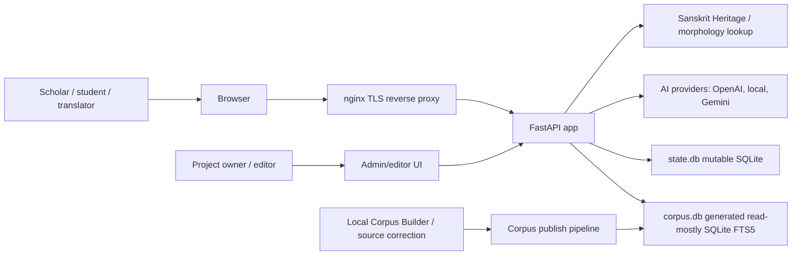
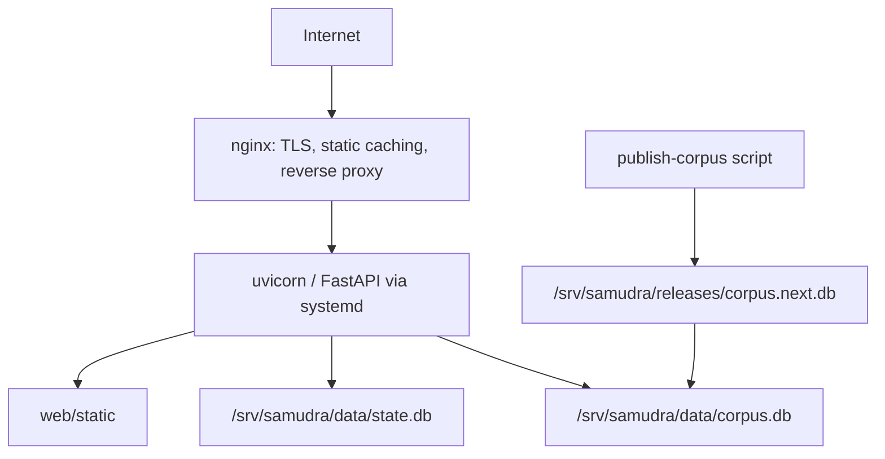
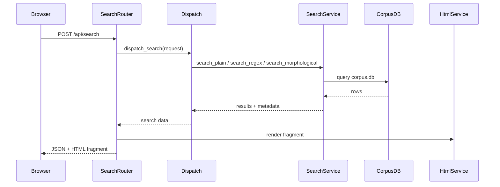
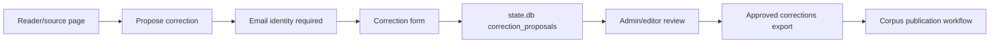
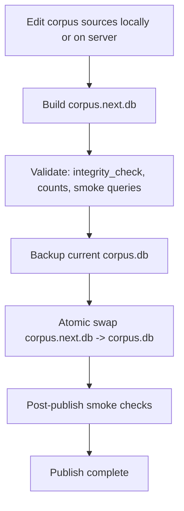

# Samudra Manthanam Target Architecture

Date: 2026-05-15

Source document: `ARCHITECTURE_REVIEW_6_MONTH_ROADMAP.md`

This document describes the target architecture for the next 6 months. It is written for Gemini Flash and future implementation agents. The goal is to make architectural boundaries explicit before adding deployment, identity, AI, and corpus editing features.

Status: current target proposal. Read `ARCHITECTURE_CRITIQUE_AND_OPEN_QUESTIONS.md` before treating decisions here as final.

## 1. Product Shape

Samudra Manthanam should become a public Sanskrit/Russian scholarly research platform with three layers:

1. Fast corpus search engine.
2. Scholarly reading and translation workbench.
3. Research platform with identity, AI assistance, and correction proposals.

The first deployment target should be a VPS without Docker.

The large generated `corpus.db` should live on the VPS filesystem, not in GitHub. GitHub stores code, docs, scripts, and tests.

## 2. Key Architecture Decisions

These decisions are current defaults, not irreversible commitments. The critique document marks several of them as provisional.

### 2.1 Use SQLite FTS5 for Corpus Search

SQLite FTS5 remains the default search engine.

Reasons:

- Current and expected corpus size is modest for SQLite.
- The corpus is mostly read-only after publication.
- Deployment is simpler on a VPS.
- External search systems would add operational weight before they are justified.

Do not introduce Meilisearch, OpenSearch, Elasticsearch, or Postgres search unless measured performance proves SQLite cannot meet the target.

### 2.2 Split Generated Corpus Data From Mutable Application Data

Use two SQLite databases:

1. `corpus.db`
   - Generated.
   - Read-mostly.
   - Replaceable by atomic publish.
   - Contains sources, corpus lines, FTS indexes, corpus metadata.

2. `state.db`
   - Mutable.
   - Never replaced during corpus publish.
   - Contains leads, consent records, magic-link/session state, correction proposals, AI cache, AI request logs, reading events, and possibly morphology cache.

This split is the most important architecture decision for the next phase.

### 2.3 Store `corpus.db` on VPS Persistent Storage

`corpus.db` is too large for normal GitHub storage. The target layout should be:

```text
/srv/samudra/
  app/                      Git checkout
  venv/                     Python virtual environment
  data/
    corpus.db               active generated corpus DB
    state.db                mutable app state DB
    backups/
      corpus-YYYYMMDD.db
  corpus/
    Data/
    Programdata/
  releases/
    corpus.next.db
```

The first version may upload `corpus.db` manually to the VPS. Later versions should support server rebuild or trusted local build plus upload.

### 2.4 Use Provider-Agnostic AI

AI must be behind a provider interface.

Required providers:

- OpenAI provider.
- OpenAI-compatible local provider.
- Gemini provider for testing and implementation experiments.
- Fake provider for tests.

Recommended first local runner: Ollama, accessed through an OpenAI-compatible local HTTP endpoint if available. The code should not be hard-coded to Ollama.

### 2.5 Start Identity With Email Capture

Identity begins as lead capture:

- Ask for name and email after meaningful reading engagement, such as reaching around 50 percent of a page.
- Show two unchecked checkboxes:
  - consent to personal data processing,
  - consent to receive promotional/news email.
- Personal data processing consent is required.
- Promotional/news email consent is optional.

The captured email becomes the future identity key for magic-link login into Systema-Sanscriticum.

Magic-link login must not automatically grant admin rights. Roles remain separate.

### 2.6 Let Email-Identified Users Propose Corrections

Correction proposals are open to email-identified users.

Admin/editor users review and approve proposals.

Approved proposals do not directly rewrite canonical corpus files. They are exported into the corpus publication workflow.

## 3. System Context



## 4. Runtime Architecture

### 4.1 VPS Runtime



Recommended service shape:

- `nginx` handles TLS and reverse proxy.
- `systemd` runs FastAPI with uvicorn.
- Python virtual environment under `/srv/samudra/venv`.
- `DB_PATH` points to active `corpus.db`.
- `STATE_DB_PATH` points to `state.db`.
- `CORPUS_PATH` points to source corpus files used by corpus sync.

### 4.2 Environment Variables

Minimum:

```text
APP_ENV=production
DB_PATH=/srv/samudra/data/corpus.db
STATE_DB_PATH=/srv/samudra/data/state.db
CORPUS_PATH=/srv/samudra/corpus
PUBLIC_BASE_URL=https://...
```

AI:

```text
AI_ENABLED=false
AI_DEFAULT_PROVIDER=openai
OPENAI_API_KEY=...
LOCAL_AI_BASE_URL=http://127.0.0.1:11434/v1
LOCAL_AI_MODEL=...
GEMINI_API_KEY=...
```

Email and magic link:

```text
EMAIL_ENABLED=false
SMTP_HOST=...
SMTP_USER=...
SMTP_PASSWORD=...
MAGIC_LINK_SECRET=...
```

Security:

```text
ALLOWED_ORIGINS=https://...
SESSION_SECRET=...
```

## 5. Application Layers

### 5.1 HTTP Layer

Existing routers:

- `web/app/routers/search.py`
- `web/app/routers/sources.py`
- `web/app/routers/morph.py`
- `web/app/routers/corpus_sync.py`

Target routers:

- `search.py`: search API, export, possibly deprecated stream endpoint.
- `sources.py`: source list and metadata.
- `reader.py`: source viewer, line context, citation pages.
- `leads.py`: name/email capture and consent.
- `auth.py`: magic-link request and verification.
- `ai.py`: AI tasks.
- `corrections.py`: correction proposal creation and admin review.
- `admin.py`: admin-only operational views.
- `health.py`: health and DB smoke checks.

The HTTP layer should validate requests, call services, and return responses. It should not contain search algorithms, AI provider details, or corpus publication logic.

### 5.2 Service Layer

Existing services:

- `dispatch_service.py`
- `search_service.py`
- `morph_service.py`
- `html_service.py`

Target services:

- `search_service.py`: FTS and regex search.
- `search_contract.py`: shared search semantics helpers if needed.
- `reader_service.py`: source context and citation lookup.
- `export_service.py`: HTML/Markdown export assembly.
- `morph_service.py`: stem/root lookup and transliteration.
- `ai_service.py`: task orchestration and provider selection.
- `providers/`: OpenAI, local, Gemini, fake.
- `lead_service.py`: lead capture and consent storage.
- `auth_service.py`: magic-link generation and session verification.
- `correction_service.py`: proposals, review, export.
- `corpus_publish_service.py`: validation, smoke checks, publish metadata.
- `telemetry_service.py`: structured logs and optional request records.

Services should accept dependencies explicitly where practical. Avoid hidden global state except central settings.

### 5.3 Storage Layer

Target modules:

- `web/app/db.py`: corpus DB connection and schema.
- `web/app/state_db.py`: state DB connection and migrations.
- `web/app/settings.py`: all paths and feature flags.
- `web/app/migrations/`: future migration scripts if the state schema becomes non-trivial.

The generated `corpus.db` should not be migrated like application state. It is rebuilt from source.

The mutable `state.db` needs migrations because it holds user and platform data.

## 6. Database Architecture

### 6.1 `corpus.db`

Purpose:

Search and source reading.

Current tables:

- `sources`
- `corpus_lines`
- `morph_cache`

Target recommendation:

- Keep `sources`.
- Keep `corpus_lines`.
- Move `morph_cache` to `state.db` eventually, because it is mutable runtime cache.
- Add corpus metadata table.

Target corpus metadata:

```sql
CREATE TABLE IF NOT EXISTS corpus_meta (
    key TEXT PRIMARY KEY,
    value TEXT NOT NULL
);
```

Recommended keys:

- `corpus_version`
- `build_time`
- `source_count`
- `line_count`
- `db_sha256`
- `manifest_sha256`

### 6.2 `state.db`

Purpose:

Mutable platform state independent of corpus rebuilds.

Initial schema areas:

1. Leads/users.
2. Consent records.
3. Reading events.
4. Magic links/sessions.
5. Correction proposals.
6. AI request log and cache.
7. Morphology cache.

Suggested initial tables:

```sql
CREATE TABLE IF NOT EXISTS users (
    id INTEGER PRIMARY KEY,
    email TEXT NOT NULL UNIQUE,
    name TEXT NOT NULL,
    role TEXT NOT NULL DEFAULT 'user',
    created_at TEXT NOT NULL,
    last_seen_at TEXT,
    magic_link_enabled INTEGER NOT NULL DEFAULT 1
);
```

```sql
CREATE TABLE IF NOT EXISTS consent_records (
    id INTEGER PRIMARY KEY,
    user_id INTEGER NOT NULL,
    consent_type TEXT NOT NULL,
    consented_at TEXT NOT NULL,
    source_url TEXT,
    ip_hash TEXT,
    user_agent TEXT,
    FOREIGN KEY(user_id) REFERENCES users(id)
);
```

Consent types:

- `personal_data_processing`
- `marketing_email`

```sql
CREATE TABLE IF NOT EXISTS reading_events (
    id INTEGER PRIMARY KEY,
    user_id INTEGER,
    anonymous_session_id TEXT,
    url TEXT NOT NULL,
    event_type TEXT NOT NULL,
    event_payload_json TEXT,
    created_at TEXT NOT NULL,
    FOREIGN KEY(user_id) REFERENCES users(id)
);
```

```sql
CREATE TABLE IF NOT EXISTS correction_proposals (
    id INTEGER PRIMARY KEY,
    source_filename TEXT NOT NULL,
    line_num INTEGER,
    link_id TEXT,
    field TEXT NOT NULL,
    old_value TEXT,
    new_value TEXT NOT NULL,
    comment TEXT,
    status TEXT NOT NULL DEFAULT 'pending',
    created_by INTEGER NOT NULL,
    created_at TEXT NOT NULL,
    reviewed_by INTEGER,
    reviewed_at TEXT,
    FOREIGN KEY(created_by) REFERENCES users(id),
    FOREIGN KEY(reviewed_by) REFERENCES users(id)
);
```

```sql
CREATE TABLE IF NOT EXISTS ai_cache (
    id INTEGER PRIMARY KEY,
    task_type TEXT NOT NULL,
    input_hash TEXT NOT NULL UNIQUE,
    provider TEXT NOT NULL,
    model TEXT NOT NULL,
    output_json TEXT NOT NULL,
    created_at TEXT NOT NULL
);
```

```sql
CREATE TABLE IF NOT EXISTS ai_requests (
    id INTEGER PRIMARY KEY,
    task_type TEXT NOT NULL,
    provider TEXT NOT NULL,
    model TEXT NOT NULL,
    input_hash TEXT NOT NULL,
    latency_ms INTEGER,
    status TEXT NOT NULL,
    error TEXT,
    created_at TEXT NOT NULL
);
```

```sql
CREATE TABLE IF NOT EXISTS morph_cache (
    query TEXT PRIMARY KEY,
    stems_json TEXT NOT NULL,
    created_at TEXT NOT NULL,
    refreshed_at TEXT NOT NULL
);
```

## 7. Search Architecture

### 7.1 Search Contract

The current contract should remain:

- Plain search uses FTS prefix matching.
- Multi-token plain search uses AND.
- Multi-line search uses OR.
- Results sort by `sources.sort_order`, then `corpus_lines.line_num`.
- Search runs against stripped text, not raw HTML.
- Display uses original HTML.

### 7.2 Search Request Flow



### 7.3 Search Hardening

Next improvements:

- Apply `limit` after whole-word and case-sensitive validation.
- Add regex pattern length limit.
- Add regex scanned-row budget.
- Add clear response metadata when timeout/budget is reached.
- Keep full-corpus regression tests separate from default unit tests.

### 7.4 Search Telemetry

Log:

- mode,
- source filter count,
- result count,
- elapsed time,
- timeout/budget flags,
- error class.

Do not log full query text by default in production. Enable it only through explicit config when needed for debugging.

## 8. Reader and Scholarly Workbench Architecture

### 8.1 Source Viewer

Add a reader layer before heavy AI or editing.

Target routes:

```text
GET /sources
GET /sources/{source_id}
GET /sources/{source_id}/line/{line_num}
GET /sources/{source_id}/anchor/{link_id}
```

Reader features:

- source title and metadata,
- chapter navigation,
- line anchors,
- hit context window,
- copy citation,
- link back to search results.

### 8.2 Citation Model

A citation should include:

- corpus version,
- source filename or source id,
- source title,
- chapter if available,
- line number,
- link id if available,
- stable URL.

Do not promise perfect scholarly immutability until corpus snapshots are implemented.

### 8.3 Export

HTML remains the main export format.

Export should include:

- query,
- search mode,
- source filter summary,
- corpus version,
- generated timestamp,
- result count,
- stable anchors.

Markdown export can be added later if it is small and useful.

## 9. Lead Capture and Identity Architecture

### 9.1 User Experience

Trigger:

- reader reaches around 50 percent scroll depth, or
- user spends enough time on a source page, or
- user attempts correction proposal.

Prompt fields:

- name,
- email,
- unchecked required checkbox: consent to personal data processing,
- unchecked optional checkbox: consent to promotional/news email.

The prompt should not aggressively block reading. It can be modal-like, but dismissal should be possible unless the action requires identity, such as correction proposal.

### 9.2 API

Target endpoints:

```text
POST /api/leads
POST /api/auth/magic-link/request
GET  /api/auth/magic-link/verify
POST /api/auth/logout
GET  /api/me
```

`POST /api/leads` should:

- validate email,
- require personal data processing consent,
- store optional marketing consent only if checked,
- create or update user by email,
- record source URL and timestamps.

### 9.3 Roles

Suggested roles:

- `user`
- `editor`
- `admin`

Email capture creates `user`.

Magic-link login authenticates identity but does not upgrade role.

Admin/editor roles are assigned manually at first.

## 10. AI Architecture

### 10.1 AI Tasks

Initial tasks:

- summarize current result set,
- explain selected passage,
- compare selected passages,
- suggest related search queries.

AI output is commentary, not source text.

Every AI response should refer to selected corpus context.

### 10.2 Provider Interface

Target module:

```text
web/app/ai/
  __init__.py
  models.py
  service.py
  providers/
    base.py
    openai_provider.py
    local_openai_provider.py
    gemini_provider.py
    fake_provider.py
```

Provider contract:

```python
class AIProvider:
    name: str

    async def complete(self, request: AIRequest) -> AIResponse:
        ...
```

Provider-independent request:

- task type,
- model,
- system instructions,
- user prompt,
- structured context,
- temperature or deterministic flag,
- max output tokens.

Provider-independent response:

- text,
- provider,
- model,
- usage if available,
- citations/context references if available,
- raw metadata for debugging only.

### 10.3 Local Provider

Implement local model support as an OpenAI-compatible HTTP provider with configurable `base_url`.

First manual runner to test:

- Ollama.

Later possible runners:

- llama.cpp server,
- LM Studio,
- vLLM.

The app should not import or depend on any one runner directly.

### 10.4 AI Safety and Reliability

Rules:

- App must run without AI keys.
- Tests use fake provider.
- AI endpoints must fail gracefully when disabled.
- Cache repeated AI requests by input hash.
- Do not send unnecessary personal data to AI providers.
- Do not allow AI to modify canonical corpus data.

## 11. Correction Proposal Architecture

### 11.1 User Flow



### 11.2 Proposal Fields

Minimum:

- source filename,
- line number,
- link id,
- field,
- old value,
- proposed new value,
- comment,
- created by,
- status.

Statuses:

- `pending`
- `approved`
- `rejected`
- `exported`
- `applied`

### 11.3 Canonical Corpus Boundary

The web app must not directly rewrite canonical HTML files in the first version.

Approved corrections should be exported as JSON or patch files. The owner/editor can then apply them through the existing corpus workflow until a safer web Corpus Builder exists.

## 12. Corpus Publication Architecture

### 12.1 Build and Publish Flow



### 12.2 Validation

Before publish:

- DB file exists and is readable.
- `PRAGMA integrity_check` returns ok.
- Source count is plausible.
- Line count is plausible.
- Golden smoke queries return plausible results.
- Manifest hashes are present.
- No missing files from `Programdata/data.txt`.
- No duplicate filenames.
- No empty source titles.

### 12.3 Rollback

Keep previous DB backup:

```text
/srv/samudra/data/backups/corpus-YYYYMMDD-HHMMSS.db
```

Rollback should:

1. Stop or reload app if needed.
2. Move current bad DB aside.
3. Restore previous DB.
4. Run smoke query.
5. Restart app if needed.

## 13. Security and Privacy Architecture

### 13.1 Before Identity Goes Live

Tighten CORS:

- Public browser app should normally be same-origin.
- Avoid `allow_origins=["*"]` once cookies, auth, or lead capture are used.

Add rate limits where practical:

- search,
- lead capture,
- magic-link requests,
- AI endpoints,
- correction proposals.

### 13.2 Consent Storage

Store:

- consent type,
- timestamp,
- source URL,
- user agent,
- optional hashed IP if legally useful.

Do not pre-check consent boxes.

Marketing/news email consent must be separate from personal data processing consent.

### 13.3 AI Privacy

AI request logs should avoid storing personal data.

For search-result summaries, store input hashes and compact structured references where possible. Avoid logging complete private user notes unless explicitly needed.

## 14. Implementation Order

### Stage 1: Storage and Deployment Foundation

Tasks:

- Add `STATE_DB_PATH`.
- Add `state_db.py`.
- Add no-Docker VPS deployment docs/scripts.
- Add health endpoint.
- Add corpus publish/validation script.

### Stage 2: Search and Reader Foundation

Tasks:

- Fix remaining search correctness edge cases.
- Add source viewer.
- Add stable citation URLs.
- Add export v2 metadata.

### Stage 3: Lead Capture and Magic-Link Foundation

Tasks:

- Add users and consent tables.
- Add lead capture endpoint and UI.
- Add magic-link skeleton.
- Add roles.
- Tighten CORS.

### Stage 4: AI Provider Interface

Tasks:

- Add provider interface and fake provider.
- Add OpenAI provider.
- Add OpenAI-compatible local provider.
- Add Gemini provider if keys/config are available.
- Add AI cache and request logs.

### Stage 5: First AI and Correction Features

Tasks:

- Add result-set summary AI feature.
- Add passage explanation feature.
- Add correction proposal overlay.
- Add admin review/export.

## 15. Gemini Flash Guardrails

Gemini Flash should follow these rules:

1. Do not mix deployment, identity, AI, and corrections in one change.
2. Add tests for every API behavior change.
3. Keep `corpus.db` out of Git.
4. Do not edit canonical corpus files unless explicitly asked.
5. Do not introduce a new frontend framework without an architecture decision.
6. Do not introduce a new search engine without benchmark evidence.
7. Keep AI optional; the app must run without AI keys.
8. Keep correction proposals separate from canonical source files.
9. Keep personal-data and marketing consent separate.
10. Preserve the current search contract unless the contract is updated first.

## 16. Standard Verification

After most web changes:

```powershell
cd C:\Users\user\Documents\GitHub\SamudraManthanam
py -3.10 -m compileall web\app web\ingest
cd web
python -m pytest
node --check static\search.js
```

For corpus-sensitive changes:

```powershell
cd C:\Users\user\Documents\GitHub\SamudraManthanam\web
$env:USE_REAL_CORPUS=1
python -m pytest -m corpus
Remove-Item Env:\USE_REAL_CORPUS
```

For deployment scripts:

```powershell
bash -n deploy/*.sh
```

## 17. Open Questions

1. Exact Russian legal wording for personal data processing consent.
2. Exact Russian wording for promotional/news email consent.
3. Whether first DB publication uploads a locally built `corpus.db` or rebuilds on VPS.
4. Which people receive initial `admin` and `editor` roles.
5. Which AI task ships first after the provider interface.
6. Whether source viewer should be implemented as server-rendered HTML first or JSON API plus current frontend.

## 18. Architecture Summary

The target architecture is deliberately modest:

- FastAPI remains the application backend.
- SQLite FTS5 remains the corpus search engine.
- VPS filesystem stores the large generated corpus DB.
- Mutable platform state moves into a separate `state.db`.
- Search and reader workflows come before heavy platform features.
- Email capture creates the identity foundation.
- AI is optional, provider-agnostic, and secondary to corpus evidence.
- Correction proposals are open to identified users but reviewed by editors.

This gives Samudra Manthanam a practical path from search app to scholarly research platform without forcing a premature rewrite.
