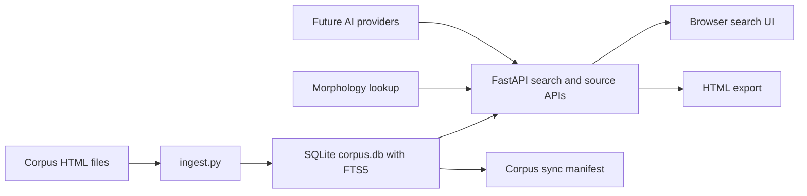

_Created: 25-08-2026 · Last updated: 05-09-2026_

# Samudra Manthanam Architecture Review and 6-Month Roadmap

Review date: 2026-05-15

> **Status (26-07-2026): HISTORICAL BRIEF.** Web-platform hardening and DH/mobile
> tracks described here largely shipped via H2 Phases 0–3e (June 2026). For live
> residual work use
> [docs/ROADMAP_SAMUDRAMANTHANAM_RESIDUAL_2026H2.md](https://github.com/gasyoun/SamudraManthanam/blob/main/docs/ROADMAP_SAMUDRAMANTHANAM_RESIDUAL_2026H2.md)
> and
> [docs/PLAN_SAMUDRAMANTHANAM_RESIDUAL_2026H2.md](https://github.com/gasyoun/SamudraManthanam/blob/main/docs/PLAN_SAMUDRAMANTHANAM_RESIDUAL_2026H2.md).

Audience: project owner, Gemini Flash, future implementation agents.

This document turns the current codebase review and product answers into a 6-month technical roadmap. It is intentionally written as an implementation brief: Gemini Flash should be able to pick up each task, make a small change, run checks, and leave a clear result.

Status: roadmap proposal (historical). Read `ARCHITECTURE_CRITIQUE_AND_OPEN_QUESTIONS.md` for challenged decisions and questions before starting large implementation work.

## Planning Inputs

Primary 6-month goals, in priority order:

1. Research platform.
2. Corpus/search engine.
3. Sanskrit/Russian scholarly tool.

Primary users:

- The project owner.
- Younger Sanskrit scholars.
- Students, including translators.

Most important "wow" functions:

- Fast search.
- Better search functionality.
- Morphology-aware work that respects existing morphology experiments.
- Export and Corpus Builder can be redesigned more freely.

Deployment preference:

- Render, Railway, Fly.io, GitHub, or VPS are acceptable for now.
- Long-term target is a server deployment without Docker.
- Clarification after planning discussion: VPS is the more natural first target if the large `corpus.db` can be uploaded and stored there directly.
- PaaS is simpler operationally, but only if it offers persistent disk storage large enough for `corpus.db`.

Corpus scale:

- Current corpus is effectively bounded for the next several years.
- The corpus is around 120,000 shlokas now.
- It may grow to around 200,000 shlokas over roughly 5 years.
- SQLite FTS5 remains a reasonable default. External search systems are optional later, not required now.

AI direction:

- Provider-agnostic architecture.
- Gemini is useful for implementation/testing.
- Product emphasis should be OpenAI plus local models.
- Recommended first local model path: an OpenAI-compatible local HTTP provider, tested first with Ollama.
- This keeps the app independent of a single runner while still giving an easy first implementation.

Identity direction:

- Current app is public.
- Desired next step is a light Systema-Sanscriticum style identity layer.
- When a reader reaches about half of a page, ask for name and email.
- This should start as low-friction lead capture, not heavy account management.
- Consent UI must have two unchecked checkboxes:
  - consent to personal data processing,
  - consent to receive promotional/news email.
- Captured email should also become the identity used for later magic-link login.
- Magic-link authentication must not automatically grant admin privileges; roles should remain separate.

Editing direction:

- Eventually, all corpus-related data should be editable through UI.
- Current workflow is local source correction, local Corpus Builder run, then upload updated server files.
- The roadmap should first improve publishing and correction workflows before attempting a full web Corpus Builder.

Scholarly guarantees:

- Stable citations, provenance, reproducible builds, and versioned corpus snapshots matter, but they are not the first priority.
- They should be introduced as foundations for later editorial work, not as a separate academic infrastructure project.

Current pain points:

- Corpus maintenance.
- Search speed.
- Additional search functions.
- AI features.
- UI.

## Executive Recommendation

Build the next 6 months in this order:

1. Corpus/search engine foundation.
2. Sanskrit/Russian scholarly tool.
3. Research platform layer.

Reasoning:

- Search is already the core value, and the corpus size is small enough for SQLite FTS5 to remain fast if the contract is clean.
- Scholarly workflows depend on trustworthy search, context display, export, and source navigation.
- Research-platform features such as identity, annotations, AI comments, and corpus editing should sit on top of stable search and corpus publication boundaries.
- A full login/admin/AI layer before search and corpus operations are stable would create product complexity without improving the daily scholarly experience.

## Current Architecture Snapshot

### Main Runtime

- `web/app/main.py`: FastAPI application, router registration, static files, template root.
- `web/app/routers/search.py`: POST search, SSE progress endpoint, HTML export endpoint.
- `web/app/routers/sources.py`: ordered source listing.
- `web/app/routers/morph.py`: morphology/stem lookup endpoint.
- `web/app/routers/corpus_sync.py`: manifest and file-serving API for corpus sync.
- `web/app/services/search_service.py`: plain FTS search and regex scan.
- `web/app/services/morph_service.py`: encoding detection, transliteration, Sanskrit Heritage lookup, variant fanout.
- `web/app/services/dispatch_service.py`: unified search dispatch.
- `web/app/services/html_service.py`: Jinja rendering for result fragments and standalone export pages.
- `web/app/db.py`: SQLite connection and schema creation.
- `web/app/settings.py`: minimal environment-based DB configuration.
- `web/ingest/ingest.py`: corpus to SQLite pipeline.
- `web/ingest/parse_html.py`: HTML line parsing and tag stripping.

### Legacy and Corpus Tooling

- `Index/`: Lazarus desktop search app.
- `Units/`: shared Pascal utilities and updater logic.
- `Corpus_builder/`: existing local desktop corpus building/correction workflow.
- `Index/lib/x86_64-win64/Data`: desktop corpus data path used by the current web ingest command.
- `build-web-db.ps1`: Windows local web DB build helper.
- `reindex.sh`: currently Docker-oriented; this conflicts with the stated no-Docker server preference.

### Data Flow



## Architecture Review

### Strengths

1. The core web architecture is simple and appropriate.
   FastAPI plus SQLite FTS5 is a good fit for a bounded scholarly corpus. The current scale does not justify OpenSearch, Meilisearch, or Postgres search as a default dependency.

2. The service boundaries are improving.
   Search dispatch, search implementation, morphology, rendering, and routers are separate enough for Gemini Flash to make PR-sized changes.

3. The search contract is now explicit.
   `web/SEARCH_CONTRACT.md` and tests make prefix search, multi-token AND, multi-line OR, and result ordering visible.

4. Default tests are now more practical.
   The hermetic fixture DB and `corpus` marker make normal testing possible without the large local `corpus.db`.

5. The corpus can be rebuilt.
   The generated DB is not the source of truth. This is important for future corpus publication and editorial workflows.

6. The app already has a useful export path.
   HTML export preserves the older scholarly workflow where results can be shared, saved, or used outside the browser.

### Constraints and Risks

1. Corpus maintenance is still local and manual.
   The current source correction path still depends on local edits, local Corpus Builder, local DB generation, and server upload. This is the biggest product bottleneck.

2. Search correctness still has edge cases.
   Whole-word and case-sensitive filters are applied after the FTS query limit, so true matches can be missed if earlier FTS candidates are filtered out. Regex has a wall-clock loop check, but a catastrophic Python regex can still block inside a single match.

3. SSE progress is no longer used by the frontend, but the endpoint remains.
   This is acceptable for compatibility, but it should either become a real job/result streaming endpoint or be deprecated.

4. Morphology is a useful experiment, not a stable morphology engine yet.
   It depends on an external Sanskrit Heritage request and a local cache. The product should continue calling it "Stem/Root Lookup" until the behavior is stronger.

5. The app has no identity boundary.
   CORS is currently open. That is tolerable for a public read-only app, but it should be tightened before lead capture, sessions, admin editing, or AI request accounting.

6. AI architecture does not exist yet.
   There is no provider interface, prompt registry, cache, rate limit, audit trail, or distinction between OpenAI, Gemini, and local models.

7. Server deployment without Docker needs its own path.
   `reindex.sh` assumes Docker. The desired future is a venv/systemd/nginx or PaaS-style Python process with explicit DB and corpus paths.

8. UI is functional but not yet a scholar workbench.
   The search page works, but the next value will come from source viewer, context windows, comparison, export metadata, saved URLs, and better result controls.

9. Stable scholarly citations are not yet first-class.
   Results use source, line number, link id, and chapter, but there is no corpus snapshot/version model that guarantees reproducible citations across rebuilds.

## Target Architecture After 6 Months

By the end of the 6-month window, the platform should have:

1. A reliable public search site.
   - Fast prefix/plain search.
   - Clear advanced search controls.
   - Stable source filtering.
   - HTML export with corpus version metadata.
   - Repeatable full-corpus regression checks.

2. A server-friendly corpus publication workflow.
   - Build DB without Docker.
   - Validate corpus before publish.
   - Atomic DB swap on server.
   - Manifest includes corpus version, file hashes, and build metadata.
   - Operator command for rebuild and rollback.

3. A scholarly reading layer.
   - Source viewer.
   - Context around hits.
   - Linkable search URLs.
   - Linkable source/line/citation URLs.
   - Export formats useful to translators and students.

4. A light Systema-Sanscriticum identity layer.
   - Name and email capture after meaningful reading engagement.
   - Consent-aware storage.
   - Magic-link login can come later, but the schema should not block it.

5. A provider-agnostic AI layer.
   - Common provider interface.
   - OpenAI provider.
   - Local model provider.
   - Gemini provider kept for testing/implementation experiments.
   - AI cache and request logs.
   - AI features scoped to explain, summarize, compare, and annotate search results.

6. First editorial/admin tools.
   - Source metadata editing first.
   - Correction proposals as overlays, not destructive direct source edits.
   - Admin export of correction patches.
   - Later integration with Corpus Builder or its replacement.

## Three Roadmap Tracks

### Track A: Corpus/Search Engine

Purpose:

Make Samudra Manthanam the fastest and most reliable search surface for the corpus.

Best for:

- Immediate user value.
- Reducing current pain.
- Creating a foundation for every other feature.

Core deliverables:

- Search correctness fixes.
- Advanced filters.
- Stable ordering and result counts.
- Corpus build and deployment path.
- Full-corpus golden query suite.
- Export parity with search results.

What not to do yet:

- Full admin editing UI.
- Deep AI commentary.
- Full login system.
- External search migration.

### Track B: Sanskrit/Russian Scholarly Tool

Purpose:

Turn search results into a real research and teaching workflow.

Best for:

- Sanskrit scholars.
- Students.
- Translators comparing passages.

Core deliverables:

- Source viewer.
- Context windows around hits.
- Citation URLs.
- Comparison mode.
- Export v2 with metadata.
- Stem/Root Lookup polish.
- Better cross-script handling.

What not to do yet:

- Promise full morphology.
- Add social/community features.
- Build a large annotation system before basic source/citation flows are strong.

### Track C: Research Platform

Purpose:

Add identity, AI assistance, annotations, and editorial operations.

Best for:

- Turning the site into Systema-Sanscriticum infrastructure.
- Capturing interested readers.
- Supporting ongoing scholarship and corpus correction.

Core deliverables:

- Light lead capture.
- Optional magic-link login.
- AI provider abstraction.
- AI summaries/explanations.
- Personal saved searches.
- Correction proposals and admin queue.
- Versioned corpus snapshots.

What not to do yet:

- Heavy roles/permissions beyond basic admin/user.
- Collaborative editing of canonical source files.
- Complex payment/commercial features.

## Recommended Combined 6-Month Plan

### Month 0-1: Stabilize Search and Server Operations

Goal:

Make the current web app a dependable public search engine and prepare a no-Docker deployment path.

Deliverables:

- No-Docker deployment profile for VPS and PaaS.
- Updated `reindex.sh` or replacement script that runs without Docker.
- Search correctness hardening for whole-word and case-sensitive filtering.
- Regex safety limits that cannot hang a worker on one pathological pattern.
- Full-corpus regression command separated from default unit tests.
- Export includes query, mode, source filters, and corpus version.
- Basic search telemetry logs: query mode, source count, result count, elapsed time, error class.

Implementation notes:

- Keep SQLite FTS5.
- Keep one FastAPI process first; add a process manager at deployment level.
- Do not add a new search engine unless measured search performance fails the target.
- Treat `/api/search/stream` as deprecated unless it becomes a true result streaming endpoint.

Success metrics:

- Plain search feels immediate for common queries.
- Default tests pass without `web/corpus.db`.
- Full corpus checks can be run intentionally.
- Rebuild and publish steps can be executed from a documented command.

### Months 2-3: Build the Scholarly Workbench

Goal:

Make search results useful for real reading, teaching, and translation work.

Deliverables:

- Source viewer route.
- Search result links into source viewer.
- Context controls around hits: exact line, small context, larger context.
- Comparison workflow for selected sources.
- Export v2:
  - HTML remains first.
  - Add metadata header.
  - Add stable citation anchors.
  - Optional Markdown export if easy.
- Stem/Root Lookup polish:
  - clearer UI label,
  - visible variants when helpful,
  - graceful external API failure,
  - cached offline fallback.
- Search URL permalinks for repeatable classroom/research use.

Implementation notes:

- Do not build a large SPA yet. Current server-rendered/Jinja plus jQuery can survive this phase.
- Keep UI dense and scholarly, not marketing-like.
- Prefer URL-addressable routes over hidden client state.

Success metrics:

- A student can open a source, search within it, and cite a result.
- A translator can compare occurrences across selected sources.
- Exported HTML can be understood later without the original browser state.

### Months 4-6: Add Research Platform Layer

Goal:

Introduce identity, AI assistance, and corpus editing without destabilizing search.

Deliverables:

- Light lead capture:
  - Trigger after about 50 percent page depth or equivalent meaningful reading engagement.
  - Ask for name and email.
  - Show two unchecked checkboxes: personal data processing consent and promotional/news email consent.
  - Require personal data processing consent before submit.
  - Do not require promotional/news email consent.
  - Store consent timestamps and source URL.
  - Do not block core reading too aggressively.
- Magic-link session foundation:
  - captured email becomes the identity key,
  - magic-link login can authenticate the user into Systema-Sanscriticum,
  - admin permissions remain role-gated and are not granted just because an email was captured.
- Provider-agnostic AI service:
  - OpenAI provider.
  - Local provider.
  - Gemini provider for testing.
  - Common request/response model.
  - Cache and request logs.
- First AI features:
  - summarize current result set,
  - explain a selected passage,
  - compare selected passages,
  - suggest related search queries.
- Admin/editorial foundation:
  - source metadata editing,
  - correction proposals,
  - admin review queue,
  - patch/export path into the existing corpus workflow.
- First corpus snapshot model:
  - version,
  - build timestamp,
  - source hashes,
  - DB hash if practical.

Implementation notes:

- Keep AI output visibly secondary to corpus text.
- Every AI answer should reference the selected source/result context.
- Do not allow AI to silently alter canonical corpus data.
- Store corpus corrections separately until a publication step applies them.

Success metrics:

- The platform captures serious readers without forcing a heavy login.
- AI features help reading and translation without replacing source evidence.
- Corpus corrections can be proposed and reviewed through the web UI.

## Proposed Data Model Additions

Add tables gradually; do not create all of them in one PR unless migrations are introduced first.

### Corpus Snapshots

Purpose:

Record a reproducible corpus build.

Fields:

- `id`
- `version`
- `created_at`
- `source_manifest_json`
- `db_sha256`
- `notes`

### Lead Capture / Lightweight Users

Purpose:

Support the Systema-Sanscriticum identity path.

Fields:

- `id`
- `name`
- `email`
- `created_at`
- `personal_data_consent_at`
- `marketing_email_consent_at` nullable
- `first_seen_url`
- `last_seen_at`
- `magic_link_enabled`
- `role`

### Reading Events

Purpose:

Track enough engagement to trigger name/email capture and understand useful pages.

Fields:

- `id`
- `user_id` nullable
- `anonymous_session_id`
- `url`
- `event_type`
- `event_payload_json`
- `created_at`

### AI Requests and Cache

Purpose:

Keep AI provider usage auditable and cache repeated explanations.

Fields:

- `id`
- `provider`
- `model`
- `task_type`
- `input_hash`
- `input_json`
- `output_json`
- `created_at`
- `latency_ms`
- `error`

### Correction Proposals

Purpose:

Allow UI-driven corpus corrections without editing canonical files directly.

Access decision:

- Email-identified users may create correction proposals.
- Admin/editor users review and approve them.
- Approved proposals still do not directly rewrite canonical corpus files; they are exported into the corpus publication workflow.

Fields:

- `id`
- `source_filename`
- `line_num`
- `link_id`
- `field`
- `old_value`
- `new_value`
- `comment`
- `status`
- `created_by`
- `created_at`
- `reviewed_at`

## Deployment Plan Without Docker

### VPS vs PaaS

VPS means a rented virtual server where we control the filesystem, Python virtual environment, nginx, systemd service, and large files. It is a better fit when we already have a server and need to keep a large `corpus.db` outside Git.

PaaS means a managed platform such as Render, Railway, or Fly.io. It is easier to start, but persistent storage for a 500 MB+ generated SQLite DB must be checked carefully. If persistent disk is not available or is expensive, PaaS becomes awkward for this project.

Decision for the first serious deployment:

- Prefer VPS.
- Keep GitHub as the code repository, not the storage location for `corpus.db`.
- Store `corpus.db` on the VPS persistent filesystem.
- Publish new DB versions by upload/rebuild plus atomic swap.

### PaaS Profile

Use this for Render, Railway, or Fly-style hosting if persistent storage is available.

Build command:

```powershell
cd web
python -m pip install -r requirements.txt
```

Start command:

```powershell
cd web
python -m uvicorn app.main:app --host 0.0.0.0 --port $PORT
```

Required environment:

- `DB_PATH=/path/to/corpus.db`
- `CORPUS_PATH=/path/to/corpus/root`

Constraint:

- PaaS is acceptable only if the generated DB can live on persistent disk or be downloaded during startup without making deploys fragile.

### VPS Profile

Recommended long-term no-Docker path:

1. Create a dedicated user.
2. Clone repo to `/srv/samudra`.
3. Create Python venv under `/srv/samudra/.venv`.
4. Install `web/requirements.txt`.
5. Build DB to `/srv/samudra/data/corpus.db`.
6. Run FastAPI through systemd.
7. Put nginx in front for TLS, static caching, and request size limits.
8. Use an atomic DB publish script:
   - build `corpus.next.db`,
   - run `PRAGMA integrity_check`,
   - run smoke queries,
   - rename current DB to backup,
   - move next DB into place,
   - restart service if needed.

Production DB handling:

- `corpus.db` should not be committed to GitHub.
- The current DB can be uploaded to the VPS manually at first.
- Later, the server should either rebuild it from corpus sources or receive `corpus.next.db` from a trusted local build.
- Keep at least one previous DB backup for rollback.

Replace current Docker-specific `reindex.sh` with a script that accepts:

- `--corpus-path`
- `--db-path`
- `--next-db-path`
- `--smoke-test`

## Gemini Flash Implementation Plan

### Working Rules for Gemini Flash

1. Work in small batches.
2. One batch should touch one architectural area.
3. Add or update tests for behavior changes.
4. Run the listed acceptance checks before finishing.
5. Do not rewrite the whole frontend unless the task explicitly asks for it.
6. Do not edit canonical corpus files in feature PRs.
7. Do not introduce external search, heavy auth, or new frontend frameworks without a decision note.
8. Preserve the term "Stem/Root Lookup" unless real morphology becomes substantially stronger.
9. AI output must never be treated as canonical corpus data.
10. Keep generated DB files out of Git.

### Standard Acceptance Checks

Run these after most web changes:

```powershell
cd C:\Users\user\Documents\GitHub\SamudraManthanam
py -3.10 -m compileall web\app web\ingest
cd web
python -m pytest
node --check static\search.js
```

For corpus-sensitive changes, also run:

```powershell
cd C:\Users\user\Documents\GitHub\SamudraManthanam\web
$env:USE_REAL_CORPUS=1
python -m pytest -m corpus
Remove-Item Env:\USE_REAL_CORPUS
```

## Gemini Flash Backlog

### GF-01: No-Docker Runtime Profile

Goal:

Make the web app deployable on a server without Docker.

Files:

- `README.md`
- `reindex.sh`
- new `deploy/` scripts if helpful
- `web/app/settings.py`

Tasks:

- Add explicit no-Docker setup docs.
- Replace or supplement Docker-only `reindex.sh`.
- Add config for `DB_PATH`, `CORPUS_PATH`, and optional `APP_ENV`.
- Add a smoke-test command that verifies DB existence and source count.

Acceptance:

- A fresh VPS can be configured from docs.
- Reindex can run without Docker.
- Existing tests pass.

### GF-02: Search Correctness Hardening

Goal:

Make search filtering correct before adding more features.

Files:

- `web/app/services/search_service.py`
- `web/SEARCH_CONTRACT.md`
- `web/tests/test_contract.py`

Tasks:

- Fix whole-word filtering so final `limit` is applied after Python-side validation.
- Fix case-sensitive filtering the same way.
- Decide whether Russian support means prefix or substring; update contract and tests.
- Add tests where early FTS candidates fail the Python filter but later candidates match.

Acceptance:

- Search contract and implementation agree.
- Tests cover whole-word, case-sensitive, multi-token, and multi-line behavior.

### GF-03: Regex Safety

Goal:

Prevent regex mode from blocking the server on pathological patterns.

Files:

- `web/app/models.py`
- `web/app/services/search_service.py`
- `web/tests/test_api.py`

Tasks:

- Add max regex pattern length.
- Add max scanned row budget.
- Consider running regex search in a bounded worker or using a safer regex package if dependencies allow.
- Return clear metadata when regex exits due to budget or timeout.

Acceptance:

- Bad regex input gets 422 or a controlled result, not a hung request.
- Normal regex tests still pass.

### GF-04: Search Telemetry

Goal:

Collect enough operational data to tune search and AI later.

Files:

- `web/app/routers/search.py`
- `web/app/services/dispatch_service.py`
- `web/app/db.py`
- tests as needed

Tasks:

- Add structured logging for search requests.
- Include mode, elapsed time, result count, source filter count, and error class.
- Do not log full query text by default unless explicitly configured.

Acceptance:

- Logs are useful for performance review.
- Sensitive query logging can be disabled.

### GF-05: Export v2

Goal:

Make exported HTML more useful for scholars and translators.

Files:

- `web/app/services/html_service.py`
- `web/templates/standalone_page.html`
- `web/templates/result_fragment.html`
- `web/app/routers/search.py`
- `web/tests/test_api.py`

Tasks:

- Add export metadata: query, mode, source filter, timestamp, corpus version if available.
- Add stable anchors for each result.
- Keep current HTML export as the primary format.
- Add Markdown export only if it is a small extension.

Acceptance:

- Export can be understood later without browser state.
- Export tests cover metadata and safe filename behavior.

### GF-06: Source Viewer

Goal:

Let users move from search result to source reading.

Files:

- `web/app/routers/sources.py` or new `web/app/routers/reader.py`
- `web/templates/`
- `web/static/search.js`
- tests

Tasks:

- Add source detail endpoint.
- Add line lookup by `source_id` and `line_num` or by `filename` and `link_id`.
- Add context window around search hits.
- Link results to source viewer.

Acceptance:

- A result can be opened in source context.
- URLs are stable enough to share.

### GF-07: Stem/Root Lookup Stabilization

Goal:

Make current morphology-adjacent behavior reliable and honest.

Files:

- `web/app/services/morph_service.py`
- `web/app/routers/morph.py`
- `web/templates/index.html`
- `web/tests/test_morph.py`

Tasks:

- Keep UI wording as "Stem/Root Lookup".
- Add clearer fallback behavior when Sanskrit Heritage is unavailable.
- Cache external lookup results predictably.
- Add tests for IAST, Devanagari, SLP1, and external failure.

Acceptance:

- Lookup mode remains useful even if the external service fails.
- Tests do not require network access by default.

### GF-08: Corpus Publication Workflow

Goal:

Reduce the pain of corpus maintenance before building full UI editing.

Files:

- `web/ingest/ingest.py`
- `web/app/db.py`
- new `web/tools/` scripts if useful
- `README.md`

Tasks:

- Add corpus validation report.
- Detect missing files, duplicate entries, empty titles, line count changes, and hash changes.
- Build DB to a temporary path first.
- Add integrity check and smoke queries.
- Document manual publish and rollback.

Acceptance:

- A corpus update can be validated before it is published.
- Failed rebuild does not overwrite the current working DB.

### GF-09: Lead Capture Foundation

Goal:

Introduce the first Systema-Sanscriticum identity step.

Files:

- `web/app/db.py`
- new `web/app/routers/leads.py`
- `web/app/main.py`
- `web/static/search.js` or new reader JS
- templates
- tests

Tasks:

- Add lead capture table with separate personal-data and marketing-email consent fields.
- Add POST endpoint for name/email/consent.
- Require the personal-data checkbox.
- Keep the marketing/promotional email checkbox optional and unchecked by default.
- Add client trigger at around 50 percent scroll depth.
- Store a local flag so the prompt is not shown repeatedly.
- Use captured email as the future magic-link identity key.
- Add a role field or related table so magic-link login does not imply admin access.
- Tighten CORS before this goes live.

Acceptance:

- Lead capture works without blocking core search.
- Invalid email is rejected.
- Personal-data consent timestamp is stored.
- Marketing consent is stored only if explicitly checked.
- Email can be reused by the future magic-link flow.

### GF-10: AI Provider Interface

Goal:

Add provider-agnostic AI without tying the product to Gemini.

Local model runner guidance:

- Recommended first implementation: OpenAI-compatible local provider with configurable `base_url`.
- First runner to test manually: Ollama, because it is easy to install and exposes a local HTTP API.
- Later options:
  - llama.cpp server for lighter low-level control,
  - LM Studio for desktop experiments,
  - vLLM for high-throughput GPU server deployments.
- Do not hard-code the product to one local runner; treat the local runner as an endpoint behind the provider interface.

Files:

- new `web/app/ai/`
- `web/app/settings.py`
- `web/app/db.py`
- tests

Tasks:

- Define a provider interface with `complete()` or task-specific methods.
- Add providers:
  - OpenAI provider,
  - OpenAI-compatible local model provider,
  - Gemini provider for tests/experiments.
- Add AI task registry:
  - summarize result set,
  - explain selected passage,
  - compare selected passages,
  - suggest related searches.
- Add cache by input hash.
- Add provider/model config through environment.

Acceptance:

- App can run without AI keys.
- Tests use a fake provider.
- AI output includes context references.

### GF-11: First AI Feature

Goal:

Ship one useful AI feature without broad platform risk.

Recommended first feature:

Summarize current result set for the visible search results.

Files:

- `web/app/ai/`
- `web/app/routers/ai.py`
- `web/app/main.py`
- `web/templates/result_fragment.html`
- `web/static/search.js`
- tests

Tasks:

- Add POST `/api/ai/summarize-results`.
- Input should reference current result IDs or compact result data.
- Use provider interface from GF-10.
- Show answer as secondary commentary, not as corpus text.

Acceptance:

- Works with fake provider in tests.
- Fails gracefully when AI is disabled.

### GF-12: Correction Proposal Overlay

Goal:

Begin web-based corpus editing without replacing Corpus Builder.

Files:

- `web/app/db.py`
- new `web/app/routers/corrections.py`
- source viewer templates
- tests

Tasks:

- Add correction proposal table.
- Add UI action from source viewer or result line.
- Allow email-identified users to create proposals.
- Store proposals separately from canonical corpus.
- Add admin listing endpoint.
- Add export of approved corrections as JSON or patch file.

Acceptance:

- Email-identified users can propose a correction.
- Admin can review proposals.
- Canonical source files are not modified automatically.

## Decisions Made

1. First serious deployment should prefer VPS because the large generated `corpus.db` can live there directly.
2. `corpus.db` should not be stored in GitHub. It should live on VPS persistent storage, with later atomic publish/rollback scripts.
3. Lead capture needs two unchecked checkboxes:
   - consent to personal data processing,
   - consent to receive promotional/news email.
4. Email capture comes first, and the same email becomes the identity for future magic-link login into Systema-Sanscriticum.
5. Admin privileges remain separate from email capture and magic-link authentication.
6. Correction proposals are open to email-identified users first, with admin/editor review.
7. Local model support should start with an OpenAI-compatible local provider, tested first with Ollama.

## Decisions Still Needed

1. Exact Russian legal/privacy wording for personal data processing consent.
2. Exact Russian wording for promotional/news email consent.
3. Whether the first VPS DB publish flow uploads `corpus.db` from the desktop or rebuilds it on the server from corpus source files.
4. Which users initially receive admin/editor roles.
5. Which AI feature ships first after the provider interface: result summary, passage explanation, passage comparison, or related-query suggestion.

## Risk Register

1. Corpus corruption during publish.
   Mitigation: build DB to temporary path, validate, then atomic swap.

2. Search semantics drift.
   Mitigation: keep `SEARCH_CONTRACT.md` and tests updated before behavior changes.

3. AI hallucination or over-authoritative wording.
   Mitigation: AI comments must cite selected corpus context and remain visually secondary.

4. Identity/privacy complexity.
   Mitigation: start with explicit consent, minimal fields, and no forced account creation.

5. Provider lock-in.
   Mitigation: provider interface, fake provider tests, cache by task/input rather than provider payload.

6. Regex performance.
   Mitigation: input limits, scan budgets, worker isolation or safer regex engine.

7. UI sprawl.
   Mitigation: add scholar workflows as dense tools, not marketing pages or unrelated dashboards.

## North Star for 6 Months

By the end of 6 months, Samudra Manthanam should feel like a serious Sanskrit/Russian research environment:

- fast enough to search during reading,
- trustworthy enough for teaching and translation,
- stable enough to publish corpus updates,
- open enough for public discovery,
- structured enough to capture serious readers,
- and ready for AI assistance without letting AI replace the corpus itself.

_Dr. Mārcis Gasūns_
