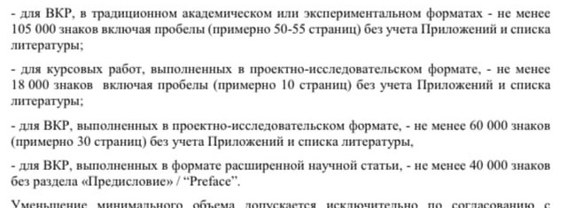
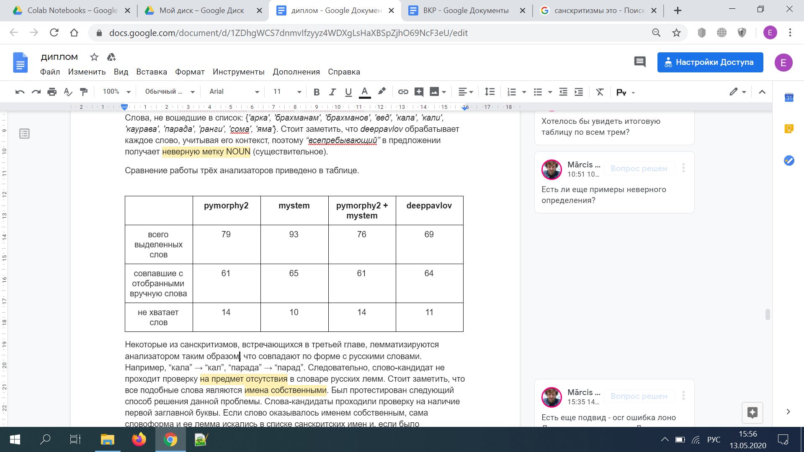
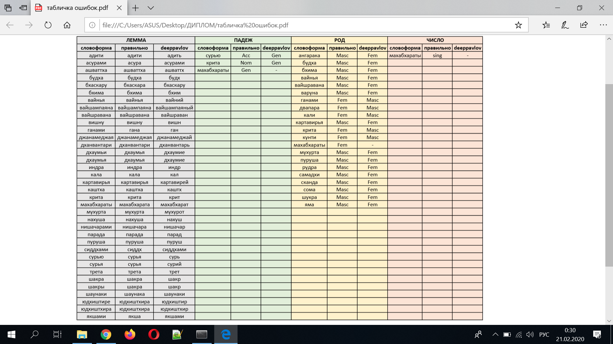
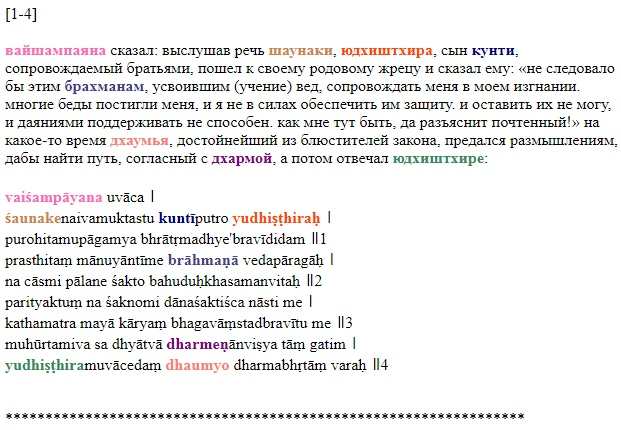

**Полуавтоматическая морфологическая разметка параллельного русско-санскритского корпуса**

**Semi-automatic Morphological Markup of a Parallel Russian-Sanskrit Corpus**

**Структура работы** (будущее оглавление)

- 1\. Введение

- 2\. Теоретические основы исследования

- 2.1 Основные термины и понятия, используемые в работе

- 2.2 Обзор предыдущих работ

- 2.3 Характеристика санскритских именованных сущностей

- 2.4 Особенности построения указателя

- 3\. Практическая часть

- 3.1 Тестирование анализаторов

- 3.2

- \...

- Заключение

- Библиография

- Приложения

**Не менее 60 тыс. знаков (включая пробелы) - примерно 30 страниц без учета Приложений и списка литературы.**



**АННОТАЦИЯ**

На сегодняшний день существует лишь несколько санскритских корпусов, среди которых нет ни одного параллельного. Работа по созданию параллельного санскритского корпуса предполагает решение ряда проблем, одними из которых являются извлечение и лемматизация санскритских имен собственных в русском тексте (если речь идет о санскритско-русском параллельном корпусе): к примеру, *Абала, Сучироман, Дурга.*

Настоящее исследование посвящено обработке имен собственных в русских переводах древнеиндийских текстов - Рамаяны и Махабхараты. В работе описывается процесс создания системы извлечения таких слов и нахождения их леммы, что впоследствии используется в разметке санскритско-русского параллельного корпуса, а также для генерации автоматических указателей к книгам.

At the moment, there are only a few Sanskrit corpora, and none of them are parallel. The work on creating a parallel Sanskrit corpus involves solving a number of issues, one of which is extraction and lemmatization of Sanskrit proper names in the Russian text (considering the Sanskrit-Russian parallel corpus) such as *Abala, Suchiroman, Durga*.

This study is devoted to the processing of proper names in Russian translations of ancient Indian epics *Ramayana* and *Mahabharata*. The paper describes the process of creating a system for extracting such words and finding their lemmas, which is subsequently used in marking the Sanskrit-Russian parallel corpus, as well as for generating automatic indexes to the aforementioned books.

**1. ВВЕДЕНИЕ**

Корпусная разметка является полезным инструментом в решении многих прикладных задач в области лингвистики, а также применяется в различных теоретических исследованиях, связанных с языком. На данный момент существует лишь несколько санскритских корпусов, что, в первую очередь, обусловлено грамматической сложностью языка. Что касается параллельных санскритских корпусов, их создание требует еще больших усилий и времени, и пока не собрана ни одна такая коллекция сопоставленных текстов. В 2005 году был анонсирован санскритско-английский корпус *Clay Sanskrit Library Corpus*, окончание работ по созданию которого должно было прийтись на осень 2007 года. Основой корпуса должен был стать текст древнеиндийских эпосов *Рамаяна* и *Махабхарата*, а также несколько работ санскритской словесности меньшего объема*.* Однако корпус так и не был опубликован.

На сегодняшний день существует лишь прототип части параллельного корпуса. М. Ю. Гасунс соотнес предложения санскритского оригинала *Ригведы* (сборника религиозных гимнов) на латинице и деванагари (санскритской письменности) и переводов на русский и английский языки. Прототип корпуса содержит 10556 предложений и опубликован на github (см. Приложение 1).

Работа по созданию параллельного санскритского корпуса (в нашем случае, русско-санскритского) предполагает решение ряда проблем, одними из которых являются извлечение и лемматизация санскритских имен собственных и терминов в русском тексте: к примеру, *Абала, Сучироман, Дурга.* На этапе сведения текстов на санскритском и русском языках также возникает вопрос соотнесения слов, в частности, имен собственных. Помимо этого, в разных книгах написание имен одних и тех же героев и топонимов различается - нет унификации - что также затрудняет обработку санскритских текстов на русском языке и процесс создания параллельного корпуса. Решению этих задач и посвящена настоящая работа.

В связи с тем, что ранее упомянутые задачи применительно к санскритским именам собственным не решались, данное исследованием представляется необходимым и **актуальным**.

**Цель** работы - создать систему, способную в полуручном режиме извлекать и обрабатывать имена собственные и термины в русском переводе санскритских текстов, в частности, в текстах одних из главных эпосов древней Индии "Махабхараты" и "Рамаяны", суммарный объем переведенных томов которых составляет более 1 миллиона и 164 тысячи слов соответственно. Помимо вклада в разработку параллельного корпуса, результат работы планируется применять в создании полу-автоматических указателей к санскритским переводам (впоследствии и к другим литературным произведениям), а также для подготовки научного аппарата книг серии "Литературные памятники", что может быть полезным в развитии областей терминологии, лексикографии, библиотечного дела и поиска информации, что, в свою очередь, определяет **практическую значимость работы**.

Поставленная цель предполагает решение следующих **задач**:

1)  сформулировать признаки извлекаемых имен собственных;

2)  составить список имен собственных из критического издания "Махабхараты" на примере третьей книги (296 809 слов);

3)  иметь возможность масштабировать список санскритских имен, подключая и другие книги "Махабхараты" и 4-ю книгу "Рамаяны" (выявлять имена, отсутствующие в списке Серенсена и списке санскритских слов);

4)  выявить и задокументировать особенности построения прежних указателей;

5)  рассмотреть существующие методы извлечения информации из текста и ее обработки;

6)  на основе рассмотренных методов определить наиболее подходящий способ решения проблемы;

7)  применить созданную систему к обработке текстов для параллельного корпуса - соотнести именованные сущности в текстах оригинала и перевода.

Для обработки текста используются готовые технологии и хорошо известные **методы** NLP: *russian stemmer snowball, pymorphy2, mystem, deeppavlov* (библиотеки для языка программирования Python), составлены условные грамматические правила для санскритских имен и терминов (rule-based approach), а также методы работы с корпусами, такие как *пересечение, сложение, вычитание* и т. д. В работе приводится сравнение эффективности вышеупомянутых методов в контексте поставленной задачи.

В качестве **источников материала** в исследовании используется текст 3-го тома Махабхараты \[Боголюбов 1987\]; список Серенсена (S. <mark>Sørensen</mark>), включающий более 9 тысяч санскритских имен (см. файл *9460-osnov-sanskritskikh-slov.txt*), полученный с сайта Cologne Digital Sanskrit Dictionaries (см. Приложение 2); список из 354 тысяч санскритских слов, полученный из санскритских словарей с того же сайта (см. Приложение 3); словарь иностранных слов \[Абрамович 1986\]; морфологический словарь русского языка из Opencorpora (см. *файл dict.opcorpora.txt*).

Работа состоит из 4 частей: введения, двух глав и заключения, - библиографии и 12 приложений.

**Библиография** включает в себя 13 единиц.

Все используемые в исследовании файлы, а также готовый код выложены на Github (см. Приложение 12).

**2. ТЕОРЕТИЧЕСКИЕ ОСНОВЫ ИССЛЕДОВАНИЯ**

*2.1 Основные термины и понятия, используемые в работе*

Ключевым понятием в настоящей работе является **именованная сущность**. Согласно \[Юсупов 2016\], под именованными сущностями обычно понимаются слова или фразы, обозначающие объект или явление определенной категории. Примерами именованных сущностей являются имена людей (*Юлия; Светлана Николаевна; Ковальчук И. Г.; Маша; В. М. Серов*), а также различные названия: организаций (*Google; Газпром; Сбербанк России; Мегафон; Тойота Мотор*), мест (*ВДНХ; Украина; Котельники; Санкт-Петербург; Сибирь*) и т. д. Мы будем использовать эту концепцию, подразумевая санскритские имена собственные и термины.

Под **несловарными словами** мы понимаем те словоформы, которые морфологический анализатор не может вывести из данных исходного словаря, который он использует. К примеру, если в словаре анализатора отсутствует слово *понимать*, то само это слово в начальной форме, а также все производные от него словоформы, будут считаться несловарными словами: *понимать, понимаю, понял, понимали, понимаем* и т. д.

**Леммой** в морфологии называется словарная форма слова, то есть та, которую можно встретить в словаре: *вести, красивый, страна, покупать, результативно* и т. д. Если провести разграничение между леммой и лексемой, можно заметить, что под лексемой объединяется множество всех имеющих один и тот же смысл форм, при этом лемма относится к одной определенной форме. Так, лексема *стол* отсылает ко всем возможным формам этого слова (*стола, столом, столу* и т. д.) в то время, как лемма *стол* не отсылает к другим формам.

Понятием **лемматизация** обозначается процесс приведения словоформы к лемме. К примеру, получение леммы *осуждать* от словоформы *осуждаю* или *ученик* от словоформы *ученику*.

**Стеммером** называется инструмент, выполняющий стемминг слов. Под **стеммингом**, в свою очередь, понимается процесс нахождения основы слова, которая не всегда совпадает с его морфологическим корнем. Так, для слова *надежда* стеммер выделяет основу *надежд* (корень - *надежд*), для слова *украсила* - основу *украсил* (корень - *крас*), а основой слова *ученик* является все слово целиком (корень - *уч*). Обычно стеммеры используются для установления связей между различными словоформами и их объединения, в случае соответствия одной лексеме. Соответственно, термином **стеммирование** будет обозначаться сам процесс отсечения окончания слова и нахождения его основы.

**Санскритизмами** в настоящей работе будут называться не только, как это принято, заимствования из санскрита, в том числе широко распространенные в русском языке, (*йога, карма, буддизм, сансара, гуру* и т. д.), но и все интересующие нас санскритские именованные сущности и термины, которые не так распространены в русском языке: *Агни, Бхогавати, Ганга, кама, Джава* и т. д.

*2.2 Обзор предыдущих работ*

Первая задача, стоящая перед нами в этом исследовании, состоит в извлечении санскритских имен из русского текста. Сегодня существует большое количество работ на тему извлечения именованных сущностей, что подтверждает неугасающий интерес к этой теме. Методы извлечения именованных сущностей можно разделить на две группы: с использованием грамматических правил (rule-based approach) и машинное обучение (machine learning).

Стоит заметить, что тема извлечения именованных сущностей особенно проработана для английского языка. Одна из самых ранних попыток идентифицировать именованные английские объекты в тексте описана в \[Rau 1991\]. В работе изложен основанный на правилах подход, предусматривающий создание определенных ограничений на основе семантического и синтаксического анализа текста. Этот метод демонстрирует хорошие результаты, однако требует предварительного анализа большого количества текстов для создания правил. К его преимуществам можно отнести отсутствие необходимости в данных для обучения алгоритма, которые иногда могут отсутствовать или быть неполными, как, например, с санскритскими именами, список которых все еще пополняется, в частности, потому, что нет современных полных указателей, а старые соответствуют старым изданиям.

Способы извлечения именованных сущностей в русском языке предложены в следующих статьях: \[Подобряев 2013\], \[Антонова, Соловьев 2013\] и \[Трофимов 2014\]. В работе \[Подобряев 2013\] демонстрируется метод поиска имен людей в новостных текстах на русском языке. Исследователи использовали машинное обучение, а точнее, модель условных случайных полей - conditional random fields model (CRF), суть которой заключается в анализе каждого слова в контексте предложения. В результате имена были получены с точностью до 86%. Тот же метод был опробован в исследовании \[Антонова & Соловьев 2013\], где точность результатов ранжировалась от 77 до 91% в зависимости от типа именованной сущности. Метод CRF оказался эффективным, в частности, благодаря снятию омонимии искомых слов.

Следующая работа демонстрирует совершенно другой подход к извлечению личных имен. \[Трофимов 2014\] использует заранее составленные словари имен и простые правила, созданные с помощью регулярных выражений. Система, описанная в статье, предназначена для поиска имен в новостных текстах. Идентификация имени осуществляется посредством сравнения слова из текста (с использованием регулярных выражений) с именами из словаря. Кроме того, исследователи описывают метод повышения точности выявления необходимой информации, который заключается в исключении из словаря имен омонимичных другим объектам: *Ливия, Рада, Израиль* и т. д. В результате система извлечения работает с точностью более 90%.

В дополнение к пошаговым методам извлечения именованных сущностей, описанным в вышеприведенных статьях, существуют целые системы, разработанные специально для этой задачи. GATE, RCO Pattern Extractor, DSTL, LSPL и Tomita-parser - инструментальные системы извлечения информации (системы IE), описанные в \[Большакова, Ефремова 2015\], которые используют шаблоны, правила и синтаксический анализ. В статье приводится сравнение эффективности систем и степени удобства с точки зрения их использования и наглядно демонстрируется превосходство двух последних - LSPL и Tomita-parser. Недостаток этих инструментов, показанный в данном исследовании, заключается в их ориентации на контекстные правила и использование готовых словарей, зашитых в систему, пополнять которые пользователю не представляется возможным.

Авторы статьи \[Zhang, Johnson 2003\] предлагают улучшить качество систем IE, добавив дополнительные признаки, такие как часть речи, длина префикса, заглавные буквы. Учитывая порой атипичную морфологию санскритских имен для русского языка, это дополнение может оказаться чрезвычайно полезным в настоящем исследовании.

Еще одна задача, которую предстоит решить в рамках данной работы, - лемматизация санскритских имен. Метод лемматизации несловарных слов описан в \[Ляшевская 2007\]. Алгоритм, предложенный в статье, устанавливает парадигматические отношения в массиве словоформ одной, разбивая каждую словоформу на псевдо-основу и псевдо-окончание и выбирая затем лучший вариант. Автор рассматривает простую и сложную кластеризацию. Первый тип включает удаление тех гипотез разделения на псевдо-основу и псевдо-окончание, вес которых меньше определенной константы. Сложная кластеризация, помимо прочего, включает также проверку того, что все окончания соответствуют одной парадигме. В результате исследователи пришли к следующему выводу: лучший вариант для лемматизации несловарных имен - объединение двух упомянутых методов. Что касается недостатков подходов, простая кластеризация не справлялась с леммами, представленными в тексте двумя словоформами, а сложная кластеризация не всегда правильно обрабатывала несклоняемые слова и оказалось ресурсозатратной по сравнению с первым методом.

Таким образом, подходы, продемонстрированные в статьях, посвященных обработке именованных сущностей, различаются по своей природе и эффективности, что зависит и от специфики извлекаемых объектов. Помимо перечисленных методов и систем, существуют также морфологические анализаторы, такие как *pymorphy2, mystem, deppavlov*, располагающие средствами лемматизации и анализа слов, отсутствующих в словаре. Их результативность в обработке санскритских имен ранее не проверялась и будет протестирована в настоящей работе.

Что касается санскритского стеммера, создание и тестирование которого будет описано в последующих главах (п. 3.3), алгоритм его функционирования разрабатывался с помощью методов, описанных в следующих вышеупомянутых работах: \[Rau 1991\] - введение ограничений на основе синтаксического анализа текста; \[Трофимов 2014\] - использование словарей имен и регулярных выражений для их поиска в тексте; \[Zhang & Johnson 2003\] - введение дополнительных признаков таких, как заглавная буква и длина слов. Выбор используемых методов производился на основе их результативности, а также учитывая специфичность извлекаемых в настоящей работе данных - санскритских именованных сущностей.

*2.3 Особенности построения указателя*

Книжный указатель, отсортированный обычно по алфавиту или устроенный по гнездовому принципу, объединяет различные части книги, в которых упоминается определенный термин, персонаж, географический объект и т. д. Примером указателя, построенного по гнездовому принципу, является указатель к 3-му тому Махабхараты, используемый в настоящей работе.

В ходе составления указателей к англоязычным книгам, а также для написания академических работ, обычно придерживаются *The Chicago Manual of Style* - стилистического справочника, являющегося также главным руководством по стилю для многих крупных организаций, вплоть до *Apple* и *American Anthropological Association*. Справочник содержит главы, касающиеся грамматики и пунктуации, оформления сокращений, названий, цитат, библиографии и указателей, а также отдельные главы для издателей книг и журналов, затрагивающие процесс публикации и некоторые связанные с этим юридические вопросы. Стоит заметить, что для русского языка такого "золотого стандарта" не существует, поэтому указатели к русскоязычным книгам разнятся в зависимости от издания.

Тем не менее в русскоязычной среде составление указателей часто происходит с опорой на книги А. Э. Мильчина: "Подготовка и редактирование аппарата книги. Как сделать книгу удобной для читателя", "Как надо и как не надо делать книги. Культура издания в примерах", "Справочная книга корректора и редактора".

Несмотря на различия в структуре некоторых указателей, все элементы любого указателя имеют две обязательные составные части: слово (или словосочетание) и ссылку на страницу книги. Также изредка присутствует и третий элемент - объяснение данного термина (аннотация). В этом случае, указатель называется *аннотированным*, в 3-м томе Махабхараты это *Аннотированный указатель флоры и фауны*. Ссылки на страницы могут выглядеть по-разному. Если единица указателя встречается на конкретной странице несколько раз, то иногда рядом с номером страницы в скобках указывают количество ее упоминаний, например, запись *102 (4)* будет означать, что единица встретилась на 102-й странице 4 раза. Если же единица указателя встречается на нескольких страницах подряд, как правило, указывают начальную и конечную страницу: запись *35-37* говорит о том, что единица встретилась на страницах номер 35, 36 и 37.

Распространенной особенностью построения указателей является *гнездовой принцип*. Гнездовой принцип, также как и алфавитный, предполагает расположение слов в алфавитном порядке, однако, в случае, если единица словаря имеет несколько вариаций в названии, они помещаются под основной вариант, нарушая тем самым общий алфавитный порядок, который продолжается после перечисления всех вариантов данной единицы указателя. В качестве примера единицы, имеющей несколько других названий, можно привести имя *Баларама* из указателя имен к третьему тому Махабхараты. Имя этого персонажа индийской мифологии имеет следующие синонимы: *Баладева, Рама.* Встречается также вариант *тот, чье оружие - плуг*, который во всех случаях указывает на этого же героя. В печатном указателе к 3-му тому Махабхараты такие рубрики выглядят следующим образом (жирным выделена основная рубрика):

> ***Баларама** 45, 626, 662, 663, 680, 694, 711, 718, 721-723*
>
> *Баладева 41, 52, 53, 57, 58, 616, 711, 721, 722*
>
> *Рама 114-115, 252-254, 465, 626, 662, 694, 711, 721*
>
> *Тот, чье оружие -- плуг 253, 369, 680, 711, 723*

Еще одним примером указателя, построенного по гнездовому принципу, является предметный указатель С. А. Крылова (Часть 1. Указатель терминов):

***группа** предложно-именная АX, АXXX; ∼ предложно-именная: значение АX; ∼ предложно-именная управляемая АXXX; ∼ предложно-падежная 423; ∼ ритмическая 219; ∼ синтаксическая 433; ∼ ∼ обособленная 417, 420, 427; ∼ ∼ обособляемая: объем 422-423; ∼ ∼ объединенная синтаксически 461; ∼ ∼ однородная 447; ∼ ∼ цельная 476;*

В настоящей работе нас интересуют, прежде всего, именные указатели, указатели флоры, терминов, а также указатели географических названий. Именно эти четыре типа именнованных сущностей встречаются в санскритских текстах, что заключено из существующих указателей к третьему тому Махабхараты. Более подробно данные указатели рассмотрены в пункте 3.3.1.

С технической точки зрения, указатели, как правило, создаются в несколько этапов. Сперва производится анализ книги относительно ее содержания и определяется, какие типы указателей необходимы данному научному изданию. В случае "Литературных памятников" это часто однотипный набор указателей. Затем составитель в ручном режиме подчеркивает (как это было раньше, в докомпьютерную эпоху, сейчас выделение слов происходит в специальных программах) в тексте искомые слова, параллельно выписывая их и номера страниц, на которых они встретились, а также помечая категорию, к которой относятся будущие единицы указателя. Кроме того, если предполагается аннотированный указатель, сразу же дается пояснение к термину, сформулированное с помощью контекста или посредством применения сторонних источников. Подробный процесс создания именных указателей описан в статье \[Соболев 2019\].

На сегодняшний день существуют программы, которые могут помочь автору в составлении указателя: *LaTex, Adobe InDesign* и т. д. Однако, функционал этих инструментов не сильно отличается от функционала других текстовых редакторов. Они предоставляют пользователю возможность вставить данные будущего указателя в подготовленные ячейки, после чего верстается указатель. Некоторые составители используют также *STARLING* - интегрированную информационную среду, разработанную С. А. Старостиным, которая имеет мощные средства для работы с текстом и базами данных (с ее помощью созданы, например, предметные указатели С. А. Крылова). Инструменты, способные без помощи человека определить, что должно войти в указатель, то есть составить его с нуля, нам неизвестны.

Еще раз подчеркнем, что одной из наших задач является разработка системы по созданию автоматических указателей, которые будут включать в себя не только все рубрики, присутствующие в печатных указателях (если таковые имеются), но и рубрики, отсутствующие в них.

*2.4 Характеристика санскритских именованных сущностей*

Санскритские именованные сущности (составляют примерно 13% текста), поиск и лемматизация которых составляют одну из главных задач настоящего исследования, можно разделить на четыре семантические группы:

1)  (мифологические и эпические) имена: *Агни, Васушена, Бхишма, Шантану, Гада, Гандхари, Индрасена* и т. д.

2)  названия растений и животных: *дару, баньян, ковидара, приянгу, чакора* и т. д.

3)  предметы и термины: *бали, аштакапала, Веды, девадатта, мантры* и т. д.

4)  географические и этнические названия: *Анга, Бхогавати, андхаки, Видарбха, драмиды* и т. д.

Санскритизмы могут быть женского или мужского рода в русском языке (в санскрите ещё и среднего), стоять в единственном или множественном числе в русском (в санскрите также в двойственном числе, например, *Ашвины*), а также склоняться по всем падежам (исключение составляют несклоняемые имена такие, как *читравати, шатадату, ашташри, аю, прекшади* и т. д. - оканчивающиеся в санскрите и в русском языке на -*и, -у* или -*ю*). Определить род санскритского слова исключительно по его внешним признакам заведомо точно невозможно. К примеру, на *а* или *я* могут заканчиваться как существительные мужского, так и женского рода: *Аурва* (м. р.), *Ума* (ж. р.); *Ахалья* (ж. р.), *Виджая* (м. р.) и т. д. То же самое верно и для других окончаний - -*и, -у, -ю*: *Видхатри* (м. р.), *Деваки* (ж. р.); *Джишну* (м. р.), *Кадру* (ж. р.); *Ваю* (м. р.), *Сараю* (ж. р.) и т. д. Если санскритизм оканчивается на согласную, скорее всего он мужского рода. Однако идентифицировать такой санскритизм в тексте представляется сложной задачей: если слово стоит в косвенном падеже, конечной буквой будет гласная, которая может быть идентична конечной гласной в этом же падеже у слова женского рода. Например, санскритизм мужского рода *брахман* в предложном падеже образует форму *брахмане*, где конечная буква - гласная *е*. Санскритизм женского рода *Ганга* в том же падеже имеет ту же конечную гласную *е* - *Ганге*.

Определение числа санскритизма легче всего происходит в случаях, когда санскритизм во множественном числе и номинативе оканчивается на *ы* - так методом исключения мы можем утверждать, что слово точно не может стоять в единственном числе, ведь в именительном падеже и единственном числе существительные на *ы* оканчиваться в русском языке не могут: *дашарны, вришнийцы, джагуды, шарвы, ядавы* - все эти названия племен стоят заведомо во множественном числе и именительном падеже. В том случае, когда падеж слова неизвестен, определение числа только по окончанию не всегда возможно, ведь на -*ы* могут также оканчиваться имена первого склонения в единственном числе, стоящие в родительном падеже: *Кала - Калы, Мудгала - Мудгалы, Пампа - Пампы, Шива - Шивы, Аста - Асты* и т. д. Если же конечная гласная - -*и,* задача усложняется, ведь на -*и,* помимо существительных в номинативе и во множественном числе (*упанги, раматхи, юги, шиби, вришни* и т. д.), могут оканчиваться также и некоторые существительные единственного числа в именительном падеже (несклоняемые): *гаятри, савитри, гопати, Дакшаяни, Дамаянти* и т. д. Также -*и* может являться конечной гласной для некоторых существительных единственного числа в косвенных падежах: *Каунака - Каунаки, Калика - Калики, Марича - Маричи, Дадхимукха - Дадхимукхи, Индрамарга - Индрамарги* и т. д.

Обобщая вышенаписанное, определение леммы санскритизмов требует разработки некоторых дополнительных морфологических правил (в случаях, когда окончание явно указывает на какую-либо морфологическую категорию), а также введения ограничений на основе синтаксического анализа - в случаях, когда морфологических правил недостаточно и необходимо знать падеж анализируемого слова. То есть без дополнительных частично вручную настраиваемых "костылей" - морфологических, синтаксических или других правил/ограничений - ни один анализатор русского языка с текстом, который содержит обильные заимствования, не справляется.

**3. ПРАКТИЧЕСКАЯ ЧАСТЬ**

*3.1 Тестирование анализаторов*

*3.1.1 Pymorphy2 и Mystem*

Эффективность работы морфологических анализаторов была проверена на третьей главе 3-го тома Махабхараты, объем которой составил 675 слов (всего). Номер главы выбирался произвольным образом. Предварительная работа с текстом включала в себя извлечение из указателей печатной книги санскритских именованных сущностей вручную для дальнейшего сравнения со списками, полученными автоматически. В такой собранный вручную список по третьей главе вошло 86 санскритизмов, из которых 75 уникальных (не повторяющихся) словоформ.

В первую очередь были протестированы наиболее распространенные анализаторы для русского языка *pymorphy2* и *mystem*, последний также является стандартом для Национального корпуса русского языка*.* Оба из них добавляют метку в морфологический анализ тех слов, которые отсутствуют в используемых словарях: у *pymorphy2* это метка *FakeDictionary,* у *mystem* - *bastard.* **Гипотеза** на этом этапе работы заключалась в том, что все несловарные слова (или, по крайней мере, подавляющее большинство) в нашем случае являются санскритизмами. Для проверки гипотезы сохранялись слова из текста, в морфологическом анализе которых присутствовала вышеупомянутая метка.

Так, с помощью *pymorphy* удалось получить всего 44 словоформы, 33 из которых входят в список отобранных вручную санскритских именованных сущностей из этой главы. Можно заметить, что 11 словоформ не должны были войти в конечный список, то есть в него попали и порой достаточно редкие, но все же образованные из русских морфем слова (далее - ложные срабатывания). Среди них, к примеру: *быстроходящий, суровейшему, вкусителю, всепребывающий, губитель* и т. д. Из этого следует два вывода: 1) в словарь *pymorphy2* входят не все русские слова, присутствующие в Махабхарате (отсюда 11 ложных срабатываний); 2) *pymorphy2* не всегда обозначает меткой несловарные слова (отсюда 33 извлеченных санскритизма из 75). Словарь, который использует анализатор *pymorphy2*, взят с сайта открытого корпуса русского языка OpenCorpora и содержит 400 тысяч лексем и 5 миллионов отдельных словоформ. Несмотря на внушительный объем используемого словаря, некоторые слова в нем отсутствуют, что вполне ожидаемо, так как ни один словарь не может содержать всех русских слов. Кроме того, в переводах древнеиндийских эпосов преобладает архаичный стиль, а также присутствуют неологизмы - кальки санскритских имен и терминов.

Результатом работы *mystem* стала 71 словоформа, 50 из которых совпадают с отобранными вручную. Несмотря на то, что в этом случае точность анализатора выше, она все еще достаточно низкая: 50 санскритизмов из 75 и 21 ложное срабатывание. Причины, из-за которых в автоматическом списке отсутствуют некоторые санскритизмы и присутствуют ложные срабатывания, аналогичны отмеченным с *pymorphy2*.

Таким образом, оба анализатора (*pymorphy2* и *mystem*) показали себя малоэффективными в извлечении санскритизмов из текста с опорой на отсутствующие в словаре слова, то есть протестированная модель поиска именованных сущностей оказалась несостоятельной для текстов с высоким уровнем заимствований. Помимо того, что в результат работы программы попадают не все нужные имена и термины, возникают также и немалочисленные ложные срабатывания, являющиеся обычными русскими словами.

*3.1.2 Словарь русского языка и Pymorphy2+Mystem*

Данные, полученные на начальном этапе работы, показали, что объем словарей, которые используют морфологические анализаторы, недостаточно велик для обработки таких специфических текстов, как Махабхарата. Исходя из этого, мы решили пополнить используемый словарь. Был создан объединенный словарь, в который вошли леммы из "Грамматического словаря русского языка" А. А. Зализняка \[Зализняк 1977\] и "Толкового словаря" Т. Ф. Ефремовой \[Ефремова 2000\]. Объем получившегося сводного списка вокабул составил 132 тысячи слов.

Для сравнения с предыдущим способом извлечения санскритизмов действие метода было рассмотрено на примере той же третьей главы. Суть метода заключалась в следующем: каждое слово текста лемматизировалось с помощью *pymorphy2* и затем сохранялось в том случае, если лемма проверяемого слова отсутствует в созданном объединенном словаре. То есть **гипотеза** относительно санскритских именованных сущностей та же, что и на предыдущем этапе, с разницей лишь в типе задействованном словаре.

В конечный список вновь, помимо искомых санскритизмов (заведомо заимствованных слов), вошли русские слова. На этот раз это связано с тем, что анализатор не справлется с лемматизацией некоторых слов: к примеру, для словоформы *нее* (генитив от *она*) предлагает лемму *нея*, которая отсутствует в словаре и, по логике программы, воспринимается как санскритское имя. Кроме того, в результатах оказались и некоторые русские причастия, а также образованные от причастий прилагательные, такие как *всепребывающий, быстроходящий, непреходящий, излучающий, тихоходящий* и т. д. Попытка очистки списка от ложных срабатываний включила в себя исключение причастий методом проверки наличия типичных для причастий суффиксов в слове (*-ущ, -ащ, -ющ, -ящ, -вш, -енн* и т. д.), а также повторную лемматизацию с помощью *mystem* с проверкой на вхождение в словарь, так как было замечено, что *mystem* справляется с определением леммы ряда слов (в числе которых вышеупомянутое *нее*) лучше, чем *pymorphy2*.

Так, получилось 76 словоформ, 61 из которых входят в составленный вручную список сущностей из третьей главы и 15 из которых являются ложными срабатываниями. Еще 14 санскритизмов не вошли в автоматический список. Как можно заметить, эффективность такого комбинированного метода выше эффективности предыдущего, где использовался каждый раз только один анализатор и встроенные в него словари.

*3.1.3 Словарь русского языка и Deeppavlov*

Тем же образом с использованием объединенного словаря был протестирован морфосинтаксический анализатор *deeppavlov* с последующим исключением причастий. Анализатор *deeppavlov* построен на основе - нейронной сети BERT, построенной компанией Google и успешно протестированной на целом ряде NLP-задач. В итоге в автоматический список санскритских именованных сущностей вошли 69 уникальных словоформ, 64 из которых входят также в составленный вручную список. 5 слов оказались ложными срабатываниями \-- пусть и не частотными, но составленными из русских морфем словами: *всепребывающий, всетворец, вкусителю, первобожество, первосущность.* Отметим, что из этих 5 слов 4 \-- сложные слова, калькирующие композиты оригинала; из них только слово *первосущность* \-- устоявшийся в языке философский термин (17 вхождений в НКРЯ), а слова *всетворец, вкуситель* и *первобожество* отмечены только в одном тексте НКРЯ каждое (все эти тексты относятся к началу XX в.). 11 санскритских имен не вошли в автоматический список: *Арка, брахманам, брахманов, Кала, Кали, каурава, Парада, Ганги, Сома* и *Яма.* <mark>Стоит заметить, что *deeppavlov,* в отличии от вышеописанных анализаторов, обрабатывает каждое слово, учитывая его контекст, поэтому *"всепребывающий"* в предложении получает неверную метку NOUN (существительное). Из трех протестированных анализаторов *deeppavlov* показал лучший результат, потому что, как уже упоминалось выше, анализатор рассматривает каждое слово не отдельно, а в контексте и, соответственно, выдает более точный морфологический разбор. Сравнение эффективности работы *pymorphy2, mystem* и *deeppavlov* в сочетании со словарем русского языка представлено в Приложении 5.</mark>

<mark>Некоторые из санскритизмов, встречающиеся в третьей главе и основы которых (а иногда и слова целиком) омонимичны основам русских слов, лемматизируются *deeppavlov*-ым таким образом, что совпадают по форме с русскими словами. Например, *Кала* → *кал*, *Парада* → *парад, Яма* → *яма, Арка* → *арка*, *Сома* → *сом* и т. д. Следовательно, слово-кандидат не проходит проверку на предмет отсутствия в словаре русских лемм. Все подобные слова, омонимичные в некоторых формам русским, являются тем не менее санскритскими именами собственными. Для того, чтобы решить эту проблему, слова из текста подверглись проверке на наличие первой заглавной буквы: если слово начиналось с заглавной буквы и не стояло при этом в начале предложения, сама словоформа и ее лемма (предложенная *deeppavlov-*ым) искались в списке Серенсена - списке лемм санскритских имен собственных в докритическом издании Махабхараты (из-за отсутствия более новых полных указателей) - и, если было обнаружено вхождение, слово включалось в выдачу. На последующем этапе очистки текста от русских слов было введено ограничение на некоторые русские суффиксы (только на те, которые состоят из комбинаций букв, не встречающихся в том же порядке в санскритских именах): если в слове встречался суффикс из списка (*-ущ, -еньк, -ек, -чик, ниц* и т. д.), оно определялось как русское и не попадало в выдачу. Также исключались слова, начинающиеся с *все-* и *перво-*: *всетворец, всепребывающий, первосущность, первобожество.*</mark>

<mark>После описанной дообработки текста получилась 71 словоформа, все из которых совпадают с отобранными вручную, то есть описываемый в этой главе метод помог избавиться от ложных срабатываний. Однако в выдачу не вошли 4 санскритизма: *брахманам, брахманов, Каурава, Ганги.* Их отсутствие в автоматическом списке объясняется тем, что в объединенном русском словаре, использовавшемся для выявления санскритизмов, присутствуют некоторые заведомо санскритские слов, которые должны входить в указатель, такие как *брахман*. Помимо этого, несмотря на то, что слова с заглавных букв проходили дополнительную проверку, слова *Ганги*, а также его автоматически определенной леммы *Ганг*, не оказалось в списке санскритских имен, поэтому в конечный список слово не вошло. Правильная лемма словоформы *Ганги* - *Ганга,* а не *Ганг,* в чем можно убедиться из предложения: *Восторжествовавший над чувствами, питающийся одним воздухом, он вошел в воды Ганги и стал совершать пранаяму.* Так как описываемый способ не решает проблемы лемматизации санскритских имен, но в то же время зависит от правильности определения лемм, некоторые санскритские имена, такие как *Ганга,* не могут попасть в автоматический список санскритских именованных сущностей. Следовательно, создаваемый инструмент обработки санскритизмов не может базироваться только на анализаторе *deeppavlov*, даже несмотря на высокую эффективность его анализа, так как остаются некоторые случаи, с которыми анализатор по умолчанию не может справиться в силу неверного определения леммы.</mark>

<mark>*3.1.4 Deeppavlov* и синтаксический анализ</mark>

<mark>В данной главе описывается точность морфосинтаксического анализа санскритских именованных сущностей, выполняемого *deeppavlov*-ым. В связи с тем, что метод извлечения санскритизмов с использованием этого анализатора показал себя лучше остальных (но, в любом случае, требует разработки дополнительного алгоритма обработки - см. предыдущую главу), было решено протестировать *deeppavlov* отдельно, а именно его способность определять падеж, род, число и, самое главное, лемму санскритских имен в тексте на русском языке. Кроме того, эта проверка предполагает попытку решения следующей поставленной задачи - лемматизации санскритизмов.</mark>

Для проверки точности морфологического анализа, выполняемого анализатором *deeppavlov,* выявленные санскритизмы были обработаны в составе предложений, так как морфологическая обработка в данном случае контекстно зависимая. За морфологический анализ в анализаторе *deeppavlov* отвечает *pymorphy2*. Но в связи с тем, что, как уже замечалось, процесс приписывания морфологических тегов происходит с учетом контекста, *deeppavlov* зачастую показывает результат лучше, чем *pymorphy2* в отдельности (и лучше, чем *mystem*). В качестве примера рассмотрим санскритское имя собственное *Дхритараштра* (царь Кауравов). *Pymorphy2* и *mystem* неверно определяет род имени как женский в то время, как *deeppavlov*, анализирую слово в составе предложения, приписывает имени мужской род.

Те же характеристики (лемма, падеж, число, род) были приписаны санскритизмам из третьей главы третьего тома Махабхараты вручную, их количество составило 79 штук. Путем подсчета количества верных морфологических тегов, полученных автоматически, был выявлен процент верных разборов - процент точности морфологического анализатора для каждой категории.

Хуже всего анализатор справился с определением леммы слов и показал точность 47%. Лучше всего - с определением числа: анализатор верно отметил 99% случаев, а также неплохо справился с падежом - 96% правильного определения. Точность определения рода составила 75%. Все обнаруженные ошибки представлены в Приложении 6.

В 69% случаев неправильной лемматизации анализатор верно определил род, число и падеж словоформы. Самой частотной ошибкой в образовании леммы стало опущение *-а* на конце слова: ровно 50% от всех ошибок этого типа. К примеру, *Будха* лемматизировалось как *Будх* (верная лемма - *Будха*, санскритское Buddha)*, Индра* - как *Индр* (верная лемма - *Индра*). Интересно, что все из этих слов (кроме одного случая: *Ганами* (инструменталис) лемматизировалось как *Ган* вместо *Гана*) стояли в именительном падеже и единственном числе, причем падеж и число определены анализатором верно. В 14% случаев неверной лемматизации анализатор оставил словоформу в исходном виде (*якшами* → *якшами* и т. д.). 8% ошибок характеризуются заменой *-и* на *-ь* на конце слова: *Адити* → *Адить* и т. д. Некоторое количество ошибок допущено с заменой *-ья* на *-ий* на конце слова (*Сурья* → *Сурий*), лемматизацией слова как прилагательного - неверный выбор части речи (*Вайшампаяна* → *Вайшампаяный*), а также появлением *-й* на конце слова (*Джанамеджая* → *Джанамеджай*). В одном случае анализатор, предположительно, нашел известную ему часть в слове и привел ее к лемме по образцу парадигмы с беглым *-о*: *Мухурта* → *Мухурот* (-*рта* → -*рот*).

Ошибка в определении падежа словоформы *Крита* связана с тем, что слово расположено в контексте перечисления и предшествующее ему слово стоит в родительном падеже: *"\... <mark>Носитель Вед, Крита, Трета, Двапара и Кали\...</mark>"*. Определив падеж слова *Вед* как родительный, анализатор приписал тот же падеж по аналогии и следующему за ним слову. В данном случае, определить падеж слова *Крита* по окончанию не представляется возможным, так как это имя может быть существительным в единственном числе и номинативе, а может являться генитивом, если лемма *Крит,* то есть окончание *-а* свойственно сразу нескольким случаям в парадигме склонения существительных. Интересно, что для следующих за именем *Крита* сущностей *Трета* и *Двапара* *deeppavlov* определил падеж верно.

В 80% случаев неверного приписывания слову женского рода (в то время, как правильный род мужской) слово заканчивалось на *-а*: *ангарака, будха, рудра, шукра, картавирья, мухурта* и т. д. Несмотря на неверное определение рода, 48% таких слов были правильно лемматизированы, все они стояли в именительном падеже.

<mark>Стоит заметить, что во всех случаях (кроме одного - *Махабхараты*) анализатор смог верно определить число. Интересно, что</mark> для слова *Махабхарата deeppavlov* не смог верно определить ни одну из категорий. Если проводить сравнение с другим анализатором, в наиболее вероятном разборе *mystem*, например, приписывает слову *Махабхарата* морфологическую характеристику краткого прилагательного от *махабхаратый*, а также считает возможным что *Махабхарата* является формой причастия от *махабхарать*. Известен также случай, когда морфологический анализатор разобрал предложил для *Махабхараты* лемму *махабхаронок.* Предложение, в котором встретилось слово, следующее: *"<mark>Такова в книге «Лесная» великой «Махабхараты» третья глава"</mark>*<mark>.</mark>

*<mark>3.1.5</mark> Russian stemmer Snowball*

Еще одним анализатором, протестированном в рамках исследования, стал стеммер *Snowball* (см. Приложение 4), разработанный специально для использования в проектах по информационному поиску и способный обрабатывать тексты на ряде романских, германских, скандинавских и других европейских языках, среди которых перечислен и русский. Стеммер написан для нескольких языков программирования, в том числе и для Python, который используется в настоящей работе.

Суть работы стеммера проста: анализатор отсекает окончания у слов, получая таким образом некоторый фрагмент, предположительно - их основу. К примеру, словоформу *важной* *Snowball* превращает в *важн*, *вазы* - в *ваз*, *пакостей* - *пакост*, *падшую - падш*, *павильон* - *павильон* и т. д. Также программа предусматривает, что парадигмы некоторых слов могут быть супплетивны, то есть словоформы в косвенных падежах могут быть непохожи на их леммы: *они* - *их, ими, них, им*; *я - меня, мной, мой* и т. д. Для осуществления правильной обработки таких случаев (а также определения основы служебных частей речи) в алгоритме стеммера задействован список исключений, который состоит из предлогов, союзов, местоимений и наречий, в их числе: *чтобы, этот, сам, весь, никогда, где, нельзя* и т. д.

Тестирование стеммера *Snowball* в подзадаче извлечения санскритских именованных сущностей снова производилось на третьей главе третьего тома Махабхараты с использованием того же объединенного словаря русских слов, что и в предыдущих тестированиях анализаторов в пунктах 3.1.2 и 3.1.3.

Предварительно был получен стеммированный список слов из объединенного словаря, объем которого, напомним, 132 тысячи слов (см. пункт 3.1.2). Каждое слово из текста (в 675 слов) пропускалось через стеммер *Snowball*, посредством чего была получена его основа, которая искалась затем в стеммированном списке слов из объединенного словаря и, если не находилась, то слово сохранялось в исходном виде, так как принималось, в нашем случае, за санскритизм.

Таким образом было получено 104 слова, 60 из которых совпали с отобранными вручную. 16 санскритизмов из списка санскритизмов по третьей главе не вошло в список, получившейся после работы программы: *арка, брахманам, брахманов, йоги, парада, сома* и т. д. Соответственно, 44 слова явились ложными срабатываниями, среди них такие слова, как: *дня, многомудрый, непроявленный, постигли, первосущность* и т. д. То есть ложными срабатываниями стали и редкие сложные слова, и слова совершенно рядовые и даже частотные, относящиеся к продуктивным парадигмам с теми или иными морфологическими операциями (*дня \-- день, постигнуть/постичь \-- постигла*).

Как видно из результатов, эффективность такого способа извлечения санскритских именованных сущностей из текста достаточно низкая. Главным образом, это обусловлено тем, что основы санскритских слов, получаемые стеммером, могут быть омонимичны основам русских слов и, соответственно, не рассматриваться программой как искомые единицы и не сохраняться для дальнейшей обработки. Среди санскритизмов, омонимичных основой русским словам: *сома* (ср. русское *сом*)*, сурья* (ср. русское *сурок*)*, яма* (ср. русское *яма*)*, парада* (ср. русское *парад*)*, вишну* (ср. русское *вишня*) и т. д. Как можно заметить, отсечение "окончаний" и установления их сочетания с "основами" происходит без учета реальных парадигм (в том числе, к окончаниям относятся словоизменительные суффиксы). Итак, использование готового стеммера, как показал пример со стеммером *Snowball*, не подходит для решения данной задачи в силу того, что данный алгоритм дает результаты, отличные от реальной русской морфологии, что увеличивает число омонимичных псевдо-"основ".

*<mark>3.2 Образование словоформ от лемм</mark>*

<mark>Другим подходом к решению задачи извлечения санскритских именованных сущностей из текста стало составление их парадигм. Суть метода состоит в следующем: от лемм из списка санскритских имен образовать все возможные словоформы, то есть составить их полные парадигмы, чтобы впоследствии выполнять поиск этих словоформ в тексте и считать их выявленными санскритизмами и кандидатами в автоматический указатель.</mark>

<mark>Преимущество описываемого метода в сравнении с предыдущими состоит в том, что извлекаемые санскритизмы не надо подвергать лемматизации, так как готовые леммы искомых словоформ уже содержатся в списке санскритских имен. Все имена из списка Серенсена стоят в номинативе и единственном числе, кроме двух во множественном - *пандавы* и *ашвины* (на санскрите - двойственное число) - они обрабатывались отдельно.</mark>

<mark>Для образования словоформ от санскритских лемм использовался анализатор *pymorphy2*, а именно - его метод *lexeme*, который позволяет получить полную парадигму анализируемого слова. Стоит заметить, что некоторые санскритские имена анализатор ошибочно не считает существительными. Так, имя *Адхармахан* *pymorphy2* определил как причастие от несуществующего глагола *адхармахать*. Соответственно, словоформы, которые анализатор образовал от этого имени, составляют мнимую глагольную парадигму: *адхармахал, адхармахаю, адхармахавшему* и т. д. То же самое происходит с именем *Дхриштадьюмна*, которое анализатор посчитал прилагательным, и образовал от него такие формы, как *дхриштадьюмный, дхриштадьюмными* и т. д.</mark>

<mark>В то же время *pymorphy2* обычно выдает сразу несколько морфологических разборов для каждого слова, как, например, с русским словом *пила,* которое анализатор определяет как существительное и как глагол в прошедшем времени (омоформа). Для того, чтобы избавиться от неверных разборов, вследствие которых образуются неверные парадигмы, применялся следующий алгоритм выбора лучшего разбора: в первую очередь, за правильный принимался тот вариант морфологического разбора, который определяет слово как существительное в номинативе и единственном числе; если же такого разбора не находилось, выбирался тот, где слово определяется как существительное в единственном числе (проверка на падеж здесь опускалась); все остальные слова, среди разборов которых не нашлось подходящего ни под первый, ни под второй случай, сохранялись отдельно - таких слов, то есть определенных не как существительные, получилось 243 штуки, что составляет 2,5% от общего числа санскритских имен из списка Серенсена (более 9 тысяч имен).</mark>

<mark>Результаты поиска сгенерированных словоформ в переводе и, соответственно, их извлечения следующие. Программа обнаружила 73 слова, 68 из которых действительно являются санскритизмами и входят также в составленный ранее список санскритизмов из третьей главы: *адити, кали, кунти, трета, юдхиштира* и т. д. 8 санскритизмов не вошло в автоматический список: *пранаяму, ганги, асурами, вивасван, самадхи, якшами, ганами, питарами*. 5 слов стали ложными срабатываниями: *и, их, им, к, ним.* Стоит заметить, что вхождения представленных ложных срабатываний в автоматический список легко избежать посредством введения списка слов-исключений, среди которых будут выявившиеся местоимения.</mark>

<mark>Несмотря на кажущуюся на первый глаз высокую результативность извлечения санскритизмов из текста, данный способ не может рассматриваться как основа для будущей программы выявления и лемматизации санскритских именованных сущностей. Дело в том, что нахождение санскритизма в тексте, в данном случае, напрямую зависит от способности анализатора порождать парадигмы к лемме. Как уже было сказано выше, некоторые санскритизмы *pymorphy2* не в состоянии распознать как существительные, поэтому словоформы, которые он от них образует, бесполезны, но самое главное - теряются настоящие словоформы этих лемм. К примеру, имя *Адхармахан* анализатор распознал как производное от глагола *адхармахать*, соответственно, словоформы, которые он от него образовал, составляют глагольную парадигму: *адхармахал, адхармахаем, адхармахают, адхармахавшая, адхармаханным* и т. д. Тем самым не генерируются существующие словоформы этого имени (*Адхармахана, Адхармахану, Адхармахане* и т. д.), следовательно, если в тексте встретится это имя в каком-либо косвенном падеже, программа его пропустит и не сможет включить в автоматический список, так как не будет рассматривать его как санскритизм.</mark>

*3.3 Стеммер санскритских именованных сущностей*

*3.3.1 Создание стеммера и тестирование на первых пяти главах Махабхараты*

Предварительное тестирование морфологических анализаторов для русского языка показало, что их эффективность в отношении русских переводов санскритских текстов и санскритских именованных сущностей невысока. По большей части, это связано с тем, что они разработаны, в первую очередь, для исконной лексики, а внешний облик санскритизмов в ряде случаев ассоциируется с более частотными русскими морфологическими моделями иной части речи. Опираясь на это предположение, было решено разработать инструмент-надстройку для выделения и обработки санскритских слов с нуля, который учитывал бы их специфическую морфологию. Преимуществом такого инструмента является его мультизадачность. Санскритский стеммер будет решать сразу два вопроса - извлечение санскритских именованных сущностей из текста и получение их леммы. Последнее будет являться частью алгоритма извлечения и производиться как поиск подходящего санскритизма в списке санскритских слов, принимая за истину, что в этом списке находятся именно леммы.

По способу обработки слов, который будет рассмотрен далее, создаваемый инструмент подходит больше всего под категорию стеммеров. Разработка санскритского стеммера проходила в пять этапов. Поэтапное тестирование системы происходило на первых пяти главах третьего тома Махабхараты. Предварительная подготовка к тестированию включила в себя воссоздание указателей к выбранным главам (выделение вручную именованных сущностей и сохранение их в список), для их дальнейшего сравнения с автоматическими, полученными в результате работы санскритского стеммера. Указатели к первым пяти главам состоят из 59, 60, 88, 21 и 55 единиц соответственно.

На **первом этапе** работы по созданию стеммера был определен общий способ работы системы - анализ слов из текста посредством отсечения окончаний и поиске получившейся основы в списке Серенсена (списке имен из Махабхараты) и общем списке санскритских слов (сконвертированном из латиницы списке слов, то есть транслитерированных на кириллицу санскритизмов). Алгоритм выделения санскритских сущностей состоял из трех частей: отдельно обрабатывались санскритизмы, заканчивающиеся на согласную букву (*брахман, Ашман, Ранхас, Сат, Вач* и т. д.) - условно второе склонение, гласную *-а* или *-я* (*Мая, Судха, Митра, Вайшравана, Ведья* и т. д.) - условно первое склонение - и на одну из букв *и, у, ю* (*Агни, Ваю, Наги, Вайшали*, *Ведабху* и т.д.) - условно список несклоняемых санскритизмов.

Обрабатываемый текст, а также слова из санскритских списков для удобства были приведены к нижнему регистру. Стоит заметить, что на первых этапах разработки стеммера заглавные буквы намеренно не учитывались, так как первостепенной задачей являлось выведение правил эффективного выделения основы каждого слова из текста и ее сравнение с основами санскритских слов независимо от того, с какой буквы проверяемое слово написано, так как не все санскритские именованные сущности в русском переводе всегда обозначены заглавной буквой.

Сперва осуществлялась проверка слова из текста на его вхождение в список условно несклоняемых санскритизмов (состоящий из 54 тыс. слов), и если оно туда входило, слово сохранялось в автоматическом сводном указателе. Процесс обработки слов из текста с проверкой их вхождения в списки санскритских имен и терминов, заканчивающихся на гласную (243 тыс. слов) и согласную (55 тыс. слов), включал в себя шесть подусловий, выполнение любого из которых вело к сохранению проверяемого слова как единицы автоматического указателя:

1.  если слово целиком или с отсеченной последней буквой входит в список санскритских слов (оканчивающихся на гласную или согласную) и его длина на одну букву меньше, чем длина слова из списка, или равна ей. <u>Пример</u>: санскритское слово *виган* упомянуто в тексте в косвенном падеже как *вигана*. Длина слова *виган* на одну букву меньше длины слова *вигана*, и *вигана* без последней буквы (*виган-*) присутствует в списке санскритских слов, следовательно, *вигана* является искомой словоформой и его лемма из списка - *виган* - добавляется в автоматический указатель.

2.  если слово заканчивается на *-м* и буква перед *-м* гласная, проверяется, совпадает ли основа этого слова (слово с отсеченными двумя последними буквами) с основой какого-либо слова из санскритского списка, причем длина проверяемого слова из текста должна быть на один меньше длины подходящего санскритизма, если санскритизм заканчивается на гласную, и на два - если на согласную. <u>Пример</u>: санскритское имя *Ахар* встречается в тексте в творительном падеже - *Ахаром*. Так как *Ахар* заканчивается на согласную и его длина на 2 меньше длины проверяемого слова из текста (*Ахаром)*, *Ахаром* считается искомым словом, *Ахар* - подходящей для него леммой и добавляется в автоматический указатель.

3.  если слово заканчивается на *-в* и буква перед *-в* гласная, проверяется, совпадает ли основа этого слова с основой какого-либо слова из санскритских списков (список Серенсена и список санскритизмов), причем длина проверяемого слова из текста должна быть на один меньше длины подходящего санскритизма. <u>Пример</u>: санскритизм *джагуды* упомянут в тексте в родительном падеже - *джагудов*. Санскритизм на один символ короче слова из текста, а также слова имеют общую основу *джагуд*, поэтому *джагуды* попадает в автоматический указатель.

4.  если слово заканчивается на *-ми* и буква перед *-ми* гласная, проверяется, совпадает ли основа этого слова с основой какого-либо слова из санскритского списка, причем длина проверяемого слова из текста должна быть на два меньше длины подходящего санскритизма. <u>Пример</u>: санскритское имя собственное *Ашвины* встретилось в тексте как *Ашвинами*. Санскритизм на две буквы короче слова из текста, а также слова имеют общую основу *ашвин* - все условия выполнены, имя *Ашвины* попадает в автоматический указатель.

5.  если слово заканчивается на *-й* и буква перед *-й* гласная, проверяется, совпадает ли основа этого слова с основой какого-либо слова из санскритского списка, причем длина проверяемого слова из текста должна быть на один меньше длины подходящего санскритизма. <u>Пример</u>: санскритизм *магха* стоит в тексте в творительном падеже и выглядит как *магхой*. Слово из текста длиннее санскритизма на одну букву, а также они имеют одну и ту же основу - *магх*, следовательно, *магха* сохраняется для автоматического указателя.

6.  если слово заканчивается на *-х* и буква перед *-х* гласная, проверяется, совпадает ли основа этого слова с основой какого-либо слова из санскритского списка, причем длина проверяемого слова из текста должна быть на один меньше длины подходящего санскритизма. <u>Пример</u>: санскритское слово *сурашатры* встречается в тексте как *сурашатрах* (стоит в косвенном падеже). Санскритизм короче слова из текста на один символ, а также имеет ту же основу - *сурашатр*, поэтому сохраняется и добавляется в автоматический указатель.

Предполагалось, что таким способом станет возможным обнаружить все (или практически все) санскритские именованные сущности в тексте, что не удалось сделать раньше ни с одним морфологическим анализатором. Однако стоило учесть, что основы санскритских слов могут быть омонимичны основам русских слов: *вод-* (санскр. *води* и рус. *вода*), *гор-* (санскр. *гор* и рус. *гора*), *велик-* (санскр. *велика* и рус. *великий*), *пут-* (санскр. *пута* и рус. *путь*), *влаг-* (санскр. *влаг* и рус. *влага*) и т. д.. А иногда совпадают и слова целиком: *края*, *лет, дар, сто, лет*. Омонимичных слов, то есть присутствующих одновременно в корпусе русского языка и в списке санскритизмов, обнаружилось 3491 единица.

По этой причине в автоматическом указателе на выборке по первым пяти главам, полученные с помощью описанного способа, вошло чрезвычайно много ложных срабатываний (русских слов): *грех, дома, духом, беды, края, будем, дитя, влагу* и т. д. Количество ложных срабатываний для каждой из пяти глав следующее (в скобках указан процент количества ложных вхождений от общего количества выявленных санскритизмов): 70 (56%), 93 (61%), 46 (66%), 14 (40%) и 46 (46%) слов соответственно, в среднем 54 ложных вхождения на одну главу. Однако стоит заметить, что автоматические указатели включили в себя практически все санскритизмы из указателей, составленных вручную, за исключением имени *Духшасана*, которое в санскритском списке имеет альтернативную орфографию - *Душасана*, потому стеммер его законно и не обнаружил. Список подобных слов-исключений, то есть имеющих вариативность в написании, будет пополняться в ходе работы над стеммером вручную.

Было замечено, что автоматический список санскритизмов, полученный на этом этапе, содержит много русских наречий и личных и указательных местоимений: *тот, меня, нас, наш, ней, там, том, тут, чем, эти, сами* и т. д. Эти единицы являются в тексте достаточно частотными, к тому же получение их настоящей основы по вышеописанному алгоритму невозможно, так как окончания местоимений несколько отличаются от окончаний существительных, для которых разработан алгоритм. В связи с этим был создан список исключений, содержащий обнаруженные местоимения и наречия, который использовался в дальнейших версиях стеммера и пополнялся по мере обнаружения подобных слов. Если слово из текста, анализируемое программой, входило в этот список, стеммер автоматически его отбрасывал и переходил к следующему.

Итак, вышеописанный способ обработки санскритских имен и терминов показал неудовлетворительный результат в обнаружении санскритизмов в тексте: несмотря на то, что удалось найти все санскритские именованные сущности, сохранилось также много ложных срабатываний. Именно поэтому **второй этап** разработки санскритского стеммера ознаменовался добавлением к алгоритму корпуса русских слов. С сайта *OpenCorpora*, открытого корпуса русского языка, был выкачан морфологический словарь, объем которого составил 3 миллиона словоформ, и обработан: слова были приведены к нижнему регистру, а буква *ё* заменена на букву *е*, так как в данном переводе *Махабхараты* (издание\...) буква *ё* не используется*.* В описываемой системе этот морфологический словарь будет называться корпусом русских слов (КРС).

Процесс обработки слов из текста на этом этапе остался тем же (см. шесть пунктов выше) за одним исключением: теперь каждое анализируемое слово проходило также проверку на присутствие в КРС, и если там обнаруживалось, то сразу отсеивалось и не попадало в автоматический указатель. В итоге желаемое было частично достигнуто и объем ложных срабатываний заметно сократился. Теперь количество русских слов в автоматических указателях по первым пяти главам составило 4, 24, 9, 5 и 2 соответственно, что суммарно на 35% меньше количества ложных вхождений в автоматический указатель на предыдущем этапе. Однако некоторые санскритизмы, успешно идентифицируемые предыдущим способом (без корпуса русских слов), теперь не вошли в полученные указатели. Среди них следующие слова: *йоги, кали, парада, сома, яма*. Такая ошибка связана с тем, что в применяемом в этом способе корпусе русских слов также содержатся и некоторые заимствования, в числе которых и приведенные выше слова, а так как описываемый метод не рассматривает слова, присутствующие в корпусе русских слов, как потенциальные санскритизмы, программа дальше их не анализирует и, соответственно, не может включить их в автоматический указатель. Стоит также подчеркнуть, что хотя количество ложных срабатываний сократилось, оно все еще было достаточно заметным.

Полученный вывод о том, что в КРС присутствуют также некоторые исконно иноязычные слова, натолкнул на мысль задействовать в программе словарь иностранных слов. Итак, на **третьем этапе** создания санскритского стеммера была протестирована эффективность использования такого словаря в решении поставленной задачи. Используемый словарь иностранных слов \[Абрамович 1986\] включил в себя 14701 заимствованных русским языком слова, среди них: *эскеры, онихия, крекинг, непотизм, буллит* и т. п.

Выявление санскритизмов проходило с использованием тех же шести подусловий, а также словаря иностранных слов. Стоит заметить, что из описываемого на данном этапе алгоритма извлечения санскритизмов был намеренно исключен корпус русских слов для того, чтобы сравнить результаты работы программы с ним и со словарем иностранных слов в отдельности. При обработке каждого слова из текста программа проверяла наличие этого слова в санскритских списках и его отсутствие в словаре иностранных слов и, если оба условия соблюдались, включала его в автоматический список.

Как и ожидалось, в конечный список вошло много ложных срабатываний - русских слов, которые теперь не отфильтровываются КРС: *речами, шар, края, трудам, тела, такой* и т. д. Однако все санскритизмы (опять же, кроме *Духшасаны* в силу орфографии), которые присутствуют в тексте, успешно были обнаружены программой и включены в автоматический список. Количество ложных срабатываний близко к числу тех же из варианта стеммера первого этапа, где также не был задействован контрастный корпус, а именно корпус русских слов, но все же немного меньше, так как часть русских слов была отфильтрована потому, что какие-то из них присутствуют в словаре иностранных слов: 51, 57, 46, 15 и 36 ложных вхождений в автоматические списки санскритизмов по первым пяти главам Махабхараты соответственно, что составляет 42% от общего количества выделенных слов, что, в свою очередь, меньше процента ложных вхождений на первом этапе на 7 и больше тех же на втором этапе на 28.

**Четвертый этап** работы включил в себя наработки всех трех предыдущих этапов разработки стеммера и объединил использование КРС и словаря иностранных слов. Анализ текста осуществлялся так же, как и на предыдущих этапах работы, но с некоторыми нововведениями. Во-первых, к предварительной обработке использующихся в программе словарей и списков добавился дополнительный шаг: из корпуса русских слов были удалены все слова, которые входили также в словарь иностранных слов. Это было сделано с целью уменьшить количество ложных срабатываний. Каждое слово из текста обрабатывалось по уже проверенной схеме, но сначала проверялось наличие слова в корпусе русских слов, и если оно там присутствовало, программа не рассматривала это слово как потенциальную рубрику автоматического указателя и переходило к следующему слову. Принципиальное отличие этого метода от метода, протестированного на втором этапе работы, состоит в исключении из корпуса русских слов слов-заимствований из других языков.

Результаты, полученные на этом этапе, значительно отличались от всех результатов, полученных ранее. В автоматические указатели, наконец, вошло минимальное количество ложных срабатываний - по одному в указателях к первой, второй и пятой главам, а третью и четвертую главы удалось проанализировать без ложных срабатываний. Количество недостающих в указателях санскритизмов также невелико, но и не минимально: 2 слова в указателе к первой главе, 7 - к третьей и 3 - к пятой. Теперь в указатели не вошли такие санскритские словоформы, как, например, *Арка, Куру, Крита, Парада, Яма* и т.д. Это объясняется тем, что основы перечисленных имен омонимичны основам русских слов, поэтому на этапе проверки вхождения каждого из этих слов в КРС, они там обнаруживались и принимались программой за русские слова.

На заключительном, **пятом этапе** разработки санскритского стеммера была предпринята попытка решить проблему невхождения ряда заведомо санскритизмов в автоматический указатель, что связано с омонимией основ некоторых русских и санскритских слов. Программа, разработанная на предыдущих этапах, была дополнена еще одной функцией, которая отвечает за сохранение всех слов, написанных с большой буквы, если они не стоят в начале предложения. Логика заключалась в том, что слова, начинающиеся с прописной буквы и стоящие не на первой позиции в предложении, являются, предположительно, именами собственными, а имена собственные в обрабатываемом тексте и есть санскритские именованные сущности, которые должны без остатка войти в полуавтоматический указатель.

Так, после срабатывания алгоритма, описанного на четвертом этапе, проверку проходили сохраненные слова, начинающиеся с большой буквы (потенциальные имена собственные). Проверка состояла из тех же шести подусловий, описанных на первом этапе, то есть если основа слова совпадало с основой какого-либо слова из санскритского списка, то оно сохранялось в автоматическом указателе. Различие между постобработкой слов с прописной буквы и обработкой слов из текста заключается в том, что слова из текста также ищутся в КРС и таким образом отфильтровываются русские слова, которые избыточны в указателе.

Эффективность такой обработки текста говорит сама за себя: лишь по одному ложному срабатыванию в первой, второй и пятой главе, помимо того, все санскритизмы в текстах были впервые успешно выявлены (кроме, закономерно, *Духшасаны*, случай с которой был описан ранее на первом этапе). Итак, этот способ извлечения санскритизмов из текста продемонстрировал лучший и достаточный результат в сравнении со способами из предыдущих четырех этапов, а также в сравнении со способами, использующими морфологические анализаторы, описанными в главе 3.1.

Сравнение точности работы всех пяти вышеописанных версий стеммера представлено в таблице в Приложении 7.

*3.3.2 Тестирование стеммера на тексте 3-го тома Махабхараты*

После получения достаточных результатов в плане извлечения санскритских именованных сущностей на выборке их первых пяти главах третьего тома Махабхараты, было проведено тестирование санскритского стеммера на всем томе, состоящим из 44 тысяч слов.

За образец были взяты указатели к третьему тому, составленные вручную: указатель имен, указатель географических названий, указатель флоры и фауны и указатель терминов. Объемы перечисленных указателей составили 931, 492, 129 и 324 рубрики соответственно. Указатели были объединены в один общий указатель (далее - *печатный указатель* или *образец*) для измерения эффективности и точности работы санскритского стеммера.

Текст третьего тома был обработан программой, и получен **первый вариант** автоматического указателе ко всей книге. В него вошла 1881 рубрика, 1285 из которых совпадают с рубриками из печатного указателя, также из них 593 новые строки (отсутствующие в печатном указателе) и 825 недостающих рубрик, которые есть в печатном и должны были теоретически войти в автоматический указатель.

Новые рубрики, появившиеся в автоматическом указателе, включают в себя ряд санскритизмов, которые не были обнаружены составителем печатного указателя, но, в большинстве случаев, являются последствиями неточной работы программы. Напомним суть работы санскритского стеммера: анализатор отсекает окончание у слов из текста (по шести моделям, описанным в пункте 3.3.1) и пробует найти леммы к ним в одном из двух санскритских списках, проходясь по каждому имени/термину. Иногда случается так, что в качестве леммы к слову из текста, согласно алгоритму, подходят сразу несколько санскритизмов. К примеру, для словоформы *ганами* находятся сразу три леммы - *ган, гана* и *ганы*, а для слова *ракшасу* - *ракшас* и *ракшаса*. Эту проблему предстояло решить немного позже, сначала сосредоточимся на недостающих рубриках.

Значительную часть из отсутствующих в печатном указателе рубрик составляют русские слова и словосочетания, отсылающие к санскритским именам (эпитеты) и ранее не рассматривавшиеся в качестве кандидатов в указатель. Это такие рубрики, в том числе отсылочные, как, например, *святые мудрецы см. риши*, *сыновья дити* *см.* *дайтьи*, *сыновья пуломы см. пауломы, демоны-змеи см. ураги, вселенский бог (владыка), тройственная вселенная см. три мира* и т. д. В связи с тем, что приведенные рубрики состоят из русских слов, ничем не отличающихся от обычных слов из текста, решением проблемы их отсутствия в автоматическом указателе стал отбор подобных рубрик из печатного указателя вручную для их целенаправленного поиска в тексте в дальнейшем. Соответственно был создан подсловарь русских эпитетов.

Нашей целью является генерация автоматических указателей, максимально приближенных к создаваемым вручную на уровне лучших научных изданий СССР. Поэтому простого поиска санскритизмов и отсылающих к ним русских словосочетаний в тексте недостаточно. Задача создания приближенного к эталону указателя усложняется тем, что в печатных указателях, как правило, помимо рубрик, состоящих из только одного слова или словосочетания, присутствуют также:

1\) так называемые, отсылочные рубрики, характеризующиеся наличием сокращения, например, *см.* в строке.

<u>Примеры</u>:

- *мудрецы-цари см. риши;*

- *нагапура см. хастинапура;*

- *насатьи см. ашвины;*

- *недруг вритры см. индра;*

- *несущий (знак) зайца см. сома* и т.д.

2\) аннотированные рубрики.

<u>Примеры</u>:

- *нипа -- Nauclea cadamba, дерево кадамба;*

- *палаша -- Butea monosperma;*

- *паравата -- Grewia asiatica, или Diospyros embryopteris;*

- *парван (день перемены луны); руру - вид антилоп* и т.д.

3\) рубрики с пояснением (родо-видовые отношения).

<u>Примеры</u>:

- *ришабха, гора;*

- *саманга, пастух;*

- *санджая, колесничий;*

- *сахадева, пандава;*

- *тара(ка), супруга брихаспати* и т.д.

4\) рубрики с другим вариантом написания (включая такие, которые в тексте не встречаются) имени/термина/названия, указанным в скобках.

<u>Примеры</u>:

- *андхры (андхраки);*

- *анги (веданги);*

- *бадари (бадарика-ашрама, вишала-бадари, превеликая бадари, великая смоковница),*

- *садьяска (садьяскра);*

- *калакеи (калеи)* и т.д.

Таким образом, появилась еще одна достаточно сложная подзадача, решение которой приближает нас к конечной цели. Эта подзадача состоит в дополнении генерируемых программой строк некоторыми сведениями, в сочетании с которой найденная лемма становится полноценной рубрикой указателя. То есть если стеммер идентифицирует в тексте слово, лемма которого *руру*, программа дополняет строку до *руру - вид антилоп* перед тем, как сохранить ее в автоматический указатель. Или, к примеру, если обнаруживается лемма *анги*, рубрика, содержащее это имя в автоматическом указателе, будет выглядеть как *анги (веданги)* и т.д.

Итак, для включения в автоматический указатель рубрик, содержащих русские слова и словосочетания, были выделены 293 такие рубрики из печатного указателя для их дальнейшего поиска в тексте (файл *rus_index.txt*). Среди них такие, как *Великий Владыка, самосозерцание, Владыка рыжих коней, Шестиликий, брат Гады* и т. д. Также были сохранены в отдельный файл (*3_INDEX_phrases.txt*) рубрики, содержащие аннотацию, отсылку или другой вариант написания единицы указателя (далее - рубрики-фразы), в количестве 721 штука: *раухитака -- Andersonia rohitaka, ююба см. бадари, богиня см. Ума, садьяска (садьяскра), ашвамедха (жертвоприношение коня)* и т. д. Рубрик с пояснениями было насчитано всего 84 штуки, они были сохранены в еще один отдельный файл (*3_INDEX_options.txt*). Это такие рубрики, как: *Айравата, змей; Дамана, мудрец; Субаху, царь Чеди; Сушена, свекор Валина; Синдху, страна* и т. д.

Файл с рубриками-фразами содержал построчно лемму, полученную от стеммера, и через двоеточие вариант полной строки, на которую нужно ее заменить для сохранения в указателе. Например, *ашвамедха **:** ашвамедха (жертвоприношение коня); калакеи **:** калакеи (калеи); раджас **:** раджас см. гуны; три мира **:** три мира (тройственная вселенная); кшатра **:** кшатрии (кшатра) см. варны* и т. д.

Рубрики с пояснениями были выделены в отдельный от рубрик-фраз файл, так как их обработка происходила несколько другим способом. Дело в том, что некоторые санскритские имена могут быть омонимичны и в печатном указателе это отражено. К примеру, *Айравата* может быть змеем (и тогда это будет соответствовать рубрике *Айравата, змей*), а может быть слоном (рубрика *Айравата, слон*). В файле с рубриками с пояснениями содержатся подобные случаи. Для того, чтобы определить, к какой из рубрик относить данное имя, был предложен следующий алгоритм: если в предложении, в котором это имя встречается, содержится именно это слово-пояснение, то относить лемму этого имени к рубрике с именно этим словом-пояснением. Допустим, рассматриваемое имя *Айравата* содержится в предложении, где также встречается слово *слон*, тогда данное имя мы автоматически отнесем к рубрике *Айравата, слон.* Пример такого предложения: *Тут увидал (Арджуна) стоящего у (городских) ворот белого, «дарующего победу» (4) слона Айравату с четырьмя бивнями, (огромного), как гора Кайласа.* В приведенном предложении *(4)* является номером сноски.

Поиск русских словосочетаний в тексте, которые отсылают к санскритским именам, оказался нетривиальной задачей. Стоило учесть, что слова могут стоять в разных падежах. Для того, чтобы стало возможным находить русские рубрики в тексте также и в косвенных падежах, были сгенерированы парадигмы для одиночных русских лемм из указателя с помощью *pymorphy2* (см. в файле *rus_index_declined.txt*). Так, например, для слова *самосозерцание* были получены словоформы *самосозерцания, самосозерцанию, самосозерцанием, самосозерцании*.

Однако, если искомая единица является словосочетанием, то просто просклонять его составляющие слова было бы неверно, так как связь слов в выделенных словосочетании бывает двух типов: 1) *согласование* - оба слова при склонении стоят в одном падеже (*великий владыка -&gt; великому владыке -&gt; великого владыки* и т. д.); 2) *управление* - зависимое слово (или группа слов) всегда стоит в косвенном падеже (*шествующий по небу, старший брат Гады, несущий знак, не из чрева рожденный* и т. д.). При связи первого типа оба слова, образующие словосочетание, склоняются одинаково, при связи второго типа склоняется только главное слово, а зависимое остается в изначальном падеже. В связи с этим, выделенные из печатного указателя русские словосочетания были вручную разбиты на две группы размеров в 24 и 8 словосочетаний, в зависимости от типа связи, и обработаны *pymorphy2*. Так, к примеру, для словосочетания *поминальная жертва* были получены другие его формы, в числе которых *поминальной жертвы, поминальной жертве, поминальной жертвой* и т. д. А для словосочетания *смущающий душу* были сгенерированы *смущающего душу, смущающих душу, смущающем душу* и т. д.

Итак, все русские слова и словосочетания из печатного указателя, а также их сгенерированные формы во всех числах и падежах, в последующих запусках программы искались в тексте, и при обнаружении вхождения проверялось, есть ли данная единица в словарях рубрик-фраз или рубрик с пояснениями и, если есть, то найденная единица заменялась на соответствующую строку из словарей перед сохранением в автоматический указатель. Так, если в тексте обнаруживалось словосочетание *тридцать богов* (в любом падеже), оно сохранялось в автоматический указатель как *тридцать (тридесять) (богов)*, потому что именно так выглядит эта строка в печатном указателе. То же самое происходило и с извлеченными из текста санскритизмами, а точнее, их леммами: если в тексте обнаруживался санскритизм *баньян*, то в указатель он сохранялся в качестве дополненной строки *баньян см. вата.* Подобные рубрики (состоящие из санскритизма и какой-либо добавочной информации к нему) так же, как и рубрики с русскими словами, составили значительную часть из тех 825 недостающих в автоматическом указателе рубрик по сравнению с печатным.

После доработки использующихся файлов и алгоритма программы тот же текст (3-й том Махабхараты) был снова обработан. В автоматический указатель новой версии вошло уже 2579 рубрик, 1794 из которых совпадали с рубриками из печатного указателя. 785 строк отсутствуют в печатном указателе, а 33 рубрики, наоборот, отсутствуют в автоматическом. Стоит заметить, что в первой версии автоматического указателя (см. выше *первый вариант*) недоставало 825 рубрик, то есть, их количество сократилось в 25 раз благодаря вышеописанным дополнениям алгоритма, а именно включение в автоматический указатель рубрик, содержащих исконно русскую лексику, а также рубрик с пояснениями.

Итак, автоматический указатель включил в себя практически все рубрики из печатного (98% рубрик - за исключением 33 штук), а также 785 рубрик, отсутствующих в последнем, что составляет 30% от всех рубрик автоматического указателя. Некоторые из новых 785 рубрик являются санскритизмами, которые не были включены в печатный указатель его составителем (С. Л. Невелева), но в большинстве случаев это множественные варианты лемм для одной словоформы. К примеру, для имени *ариштанема* программой были предложены варианты лемм *ариштанема* и *ариштанеми*, для санскритизма *бхану* - леммы *бхана* и *бхану*. Наличие нескольких вариантов лемм для некоторых слов объясняется тем, что суть работы стеммера состоит в механическом отсечении окончания анализируемого слова и поиске подходящей для него леммы, у которой та же основа. То есть, имея в тексте словоформу *пундары*, анализатор не может точно указать, какая из лемм *пундара* и *пундари* является верной, поэтому сохраняет оба варианта. Также были обнаружены некоторые имена, не входящие в список Серенсена и список санскритских слов по причине различий в орфографии: *Душала* в списке - *Духшала* в тексте; *Дхритараштра* в списке - *Дритараштра* в тексте; *Душасана* в списке - *Духшасана* в тексте.

Важно также, что при создании первой версии автоматического указателя по ошибке анализу подвергался только перевод эпоса, в последнюю же версию указателя вошли также имена из приложений, включая комментарии к тексту, то есть обрабатывался текст книги целиком. Поэтому количество новых рубрик несколько увеличилось, что, в первую очередь, связано с тем, что теперь идентифицируется большее количество имен в тексте, а соответственно, генерируется больше лемм и их вариантов.

Решение вопроса выбора леммы из предлагаемых программой вариантов и, как следствие, сокращение 785 рубрик будет рассмотрено в следующей главе.

*3.3.3 Тестирование стеммера на тексте 3-го тома Рамаяны*

После достижения достаточной точности санскритского стеммера (см. финальную версию в предыдущем пункте 3.3.2) - 98% в обнаружении санскритских именованных сущностей и 70% в лемматизации - тестирование программы было продолжено на другом древнеиндийском эпосе *Рамаяна* (а именно, его 3-м томе). Отличие обработки этого текста от анализа *Махабхараты*, описанного в предыдущем пункте 3.3.2, состоит в том, что ранее стеммер опирался на существующий и составленный вручную печатный указатель к обрабатываемому тексту (3-й том *Махабхараты*), теперь же такой опоры нет, потому что печатные указатели к русскому академическому переводу *Рамаяны*, включая 3-й том, до этого не создавались, в отступление от стандарта "Литературных памятников"

Опора анализатора на печатный указатель состояла в том, что из него были предварительно выделены 2 типа рубрик: 1) рубрики, содержащие русские слова, которые впоследствии целенаправленно искались в тексте; 2) рубрики, содержащие аннотацию или пояснение, для последующего в них преобразования выделенных из текста санскритизмов или русских слов, к ним отсылающих.

Санскритский стеммер на *Рамаяне* был запущен с использованием собранных на предыдущем этапе списков (в ходе работы над Махабхаратой), содержащих рубрики с русскими словами и с пояснениями или аннотациями (время работы программы составило 7 минут). То есть алгоритм работы программы был полностью идентичен предыдущему (см. пункт 3.3.2), хотя здесь обработке подлежал стихотворный перевод, в отличие от прозаического в Махабхарате.

В результате программа выдала 525 рубрик автоматического указателя. Среди них обнаружились рубрики с аннотациями и пояснениями, взятые изначально из печатного указателя к 3-му тому *Махабхараты*, которые вошли в автоматический указатель за счет собранных списков (см. выше описание двух типов рубрик): *амрита, нектар бессмертия; агнихотра (жертвоприношение огню); богиня см. ума; бхарата, огонь; ваю (ветер); джамбу -- eugenia jambolana, вечнозеленое дерево* и т. д.

Однако стоит заметить, что в автоматический указатель вошло также достаточно большое количество избыточных рубрик, наличие которых является результатом проблемы выбора леммы из предлагаемых вариантов, то есть те рубрики, которые указывают в тексте на одни и те же единицы: *агнимукха* и *агнимукхи*, *апсара* и *апсары*, *кетака* и *кетаки*, *иравата* и *иравати*, *ракшас* и *ракшаса*, *хара* и *хари* и т. д. Такая неопределенность в лемме вызвана тем, что программа проходится по двум спискам санскритских слов (список Серенсена и список санскритских слов) целиком и подбирает все подходящие для словоформы в тексте варианты. К примеру, для словоформы *ракшасов* программа нашла леммы *ракшаси, ракшас, ракшаса*, потому что основа всех этих вариантов совпадает с основой анализируемого слова.

Первым шагом в определении правильного варианта леммы для таких случаев стало создание вспомогательных морфологических правил, описывающих парадигмы существительных с определенными окончаниями. Итак, было разработано девять правил (очередность их выполнения не имеет значения):

1.  Если словоформа в тексте оканчивается на *-в*, то ее лемма должна оканчиваться на -*и* или *-ы*, то есть стоять во множественном числе. <u>Пример</u>: для словоформы *ракшасов* из вариантов *ракшаси, ракшаса* и *ракшасы* программа выберет последний.

2.  Если словоформа в тексте оканчивается на *-ой*, то ее лемма не должна оканчиваться на -*и* или *-ы*, то есть стоять в единственном числе. <u>Пример</u>: для словоформы *ракшасой* из вариантов *ракшаси, ракшаса* и *ракшасы* программа выберет *ракшаса* и *ракшаси*, то есть отметет последний.

3.  Если словоформа в тексте оканчивается на *-ми*, то ее лемма должна оканчиваться на -*и* или *-ы*, то есть стоять во множественном числе. <u>Пример</u>: для словоформы *читрами* из вариантов *читра* и *читры* программа выберет последний.

4.  Если словоформа в тексте оканчивается на *-х*, то ее лемма должна оканчиваться на -*и* или *-ы*, то есть стоять во множественном числе. <u>Пример</u>: для словоформы *шастрах* из вариантов *шастра* и *шастры* программа выберет последний.

5.  Если словоформа в тексте оканчивается на *-у, -е, -ю* или *-о*, то ее лемма не должна оканчиваться на -*и* или *-ы*, то есть стоять в единственном числе. <u>Пример</u>: для словоформы *шардулу* из вариантов *шардула* и *шардулы* программа выберет первый.

6.  Если словоформа в тексте оканчивается на *-ам* или *-ям*, то ее лемма должна оканчиваться на -*и* или *-ы*, то есть стоять во множественном числе. <u>Пример</u>: для словоформы *ракшасам* из вариантов *ракшаси, ракшаса* и *ракшасы* программа выберет *ракшаси* и *ракшасы*.

7.  Если словоформа в тексте оканчивается на *-ом* или *-ем*, то ее лемма не должна оканчиваться на -*и* или *-ы*, то есть стоять в единственном числе. <u>Пример</u>: для словоформы *лакшманом* из вариантов *лакшман, лакшамана* и *лакшманы* программа выберет *лакшман* и *лакшмана* (то есть отметет лемму *лакшманы*).

8.  Если словоформа в тексте оканчивается на гласную букву, перед которой стоит любая согласная из \[*с, л, р, н, з, ф, в, п, д, м, т, б*\] и последней буквой словоформы является *-и*, то ее лемма тоже должна оканчиваться на *-и*. <u>Пример:</u> для словоформы *кадали* из вариантов *кадала* и *кадали* программа выберет последний.

9.  Если словоформа в тексте оканчивается на гласную букву, перед которой стоит любая согласная из \[*с, л, р, н, з, ф, в, п, д, м, т, б*\] и последней буквой словоформы не является *-и*, то ее лемма тоже не должна оканчиваться на *-и*. <u>Пример:</u> для словоформы *кадала* из вариантов *кадала* и *кадали* программа выберет первый.

Разработанные нами дополнительные правила определения леммы санскритизмов основываются на парадигмах склонения слов в русском языке. Как видно из примеров, хотя введение новых условий в анализе помогает разрешить некоторые ситуации неопределенности леммы, это работает не для всех случаев - если вариантов леммы было изначально больше двух, отмести сразу все кроме одного не представляется возможным, так как в таких ситуациях условию удовлетворяет больше, чем одна лемма (см. примеры выше в правилах 2, 6, 7). Получается, что с помощью вышеописанной дополнительной обработки удалось отмести леммы, которые точно не могут составлять часть парадигмы словоформы, однако в каких-то случаях (когда было всего два варианта леммы) это помогло убрать неопределенность, а в других (когда вариантов леммы было больше двух) только уменьшило количество предполагаемых вариантов лемм.

Итак, оставшиеся случаи с неопределенной леммой (96 случаев или 20% от общего числа рубрик), получается, невозможно разрешить без использования контекста. К примеру, если в тексте встречается словоформа *Лакшмана,* без знания ее падежа мы не можем сказать наверняка, является ли эта словоформа производной от *Лакшман* (и, соответственно, стоит в косвенном падеже) или рассматриваемая словоформа и является леммой (хотя и диахронически связанной с исходным *Лакшман* с основой на согласную) сама по себе - *Лакшмана*.

Для получения падежной информации о словах из текста использовался морфосинтаксический анализатор *deeppavlov*, эффективность которого в определении падежа описана в пункте 3.1.4 настоящей работы и составляет приблизительно 96%*.* С целью ускорить последующие запуски программы текст 3-го тома *Рамаяны* (состоящий из 2441 предложений см. файл *Рамаяна_3.txt*) был предварительно обработан анализатором целиком, а результат обработки записан в файл *deeppavlov_ram_3.txt*. Анализ предложений, полученный от *deeppavlov*, содержал морфологическую информацию о каждом слове, а также информацию о зависимых этого слова и том слове, от которого оно синтаксически зависит.

Обработка оставшихся случаев с несколькими вариантами леммы происходила следующим образом. Сначала анализировались те случаи, в которых санскритизм стоит в номинативе. Если его форма в предложении совпадало с рассматриваемой леммой, тогда эта лемма считалась искомой. К примеру, санскритское имя *Дхаумья* стоит в предложении в именительном падеже, соответственно, из вариантов лемм *Дхаумья* и *Дхаумьи*, программа выберет первую, так как та совпадает со словоформой из предложения, которая находится в номинативе.

Если же словоформа в предложении стоит в каком-либо косвенном падеже, программа проверяет, встречается ли это слово в других формах в тексте. Если не встречается, тогда слово считается несклоняемым, и, соответственно, леммой должна являться сама словоформа - выбирается та лемма, которая равно словоформе. В том случае, когда рассматриваемая словоформа встречается в других формах в тексте, выбирается та лемма, которая не заканчивается на *-и*, так как на эту букву заканчиваются несклоняемые имена.

К примеру, имя *Яду* встречается в тексте только в этой форме, следовательно, из двух вариантов леммы *Яда* и *Яду*, программа выбирает второй - *Яду*. Другая ситуация происходит со словоформой *ракшас*, которая встречается в тексте в нескольких формах (*ракшасу, ракшасой, ракшасе*), следовательно, из двух вариантов леммы *ракшас* и *ракшаси* программа выбирает первый, так как *ракшаси* оканчивается на *-и* и считается несклоняемым словом.

Описанная дополнительная обработка выделенных санскритизмов, включающая в себя ряд разработанных морфологических правил с опорой на анализ *deeppavlov*, позволила сократить количество рубрик в автоматическом указателе к третьему тому *Рамаяны* с первоначальных 525 до 414 рубрик за счет разрешения ряда случаев с несколькими вариантами леммы. Однако в указателе сохранились некоторые рубрики, которые являются разными словоформами одной санскритской именованной сущности: *апсара* и *апсары, васука* и *васуки*, *гаруда* и *гаруды,* *дандака* и *дандаки*, *яма* и *ямы* и т. д. Это обусловлено тем, что такие сущности встречаются в тексте и в единственном, и во множественном числе. Итак, новая задача - объединение подобных псевдорубрик указателя в одну настоящую.

Решение данной проблемы осуществлял следующий алгоритм. Сначала программа находила такие рубрики с помощью анализа основ первого слова каждой строки автоматического указателя. Затем автоматически выбирался тот вариант, который стоял во множественном числе, то есть оканчивающийся на *-и* или *-ы*. Таким образом удалось сократить указатель до 380 рубрик и избавиться от повторяющихся в нем ошибочных сущностей. В Приложении 8 приведен фрагмент получившегося автоматического указателя к 3-му тому Рамаяны.

*3.4 Работа с параллельным корпусом*

Разработанная программа обработки санскритских именованных сущностей может быть полезна не только для составления книжных указателей, но и в разметке (и выравнивании) корпуса, в том числе параллельного. Стеммер для санскритизмов 1) позволяет извлекать санскритские именованные сущности из русского текста и 2) предлагает для них лемму. Для работы с корпусом нам понадобится только первая его функция. Поставленная задача, решение которой было бы полезным для выравнивания параллельного русско-санскритского корпуса, состоит в том, чтобы соотнести именованные сущности в оригинальном тексте на санскрите (латинице) и его русском переводе. Иными словами, необходимо разработать алгоритм, позволяющий определять, что, например, санскритское *dhaumyo* в определенном фрагменте оригинала соответствует русскому *Дхаумья* в переводе.

Именованные сущности на санскрите могут как являться частью слова с несколькими корнями, так и представлять собой отдельную текстовую единицу. К примеру, слова *vaiśampāyana, <mark>janamejaya, brāhmaṇā, dhaumyo </mark>*<mark>и *tejaśca,* относящиеся к категории санскритских именованных сущностей, содержат один корень и, соответственно, обозначают только один объект/сущность. К другому типу санскритских слов относятся: *śaunakenaivamuktastu, vedapāragāḥ, hyasuraniśācarasiddhavanditam, jāṭharaścāgniraindhanastejasāṃ, dharmātmankarmaṇā* и т. д. Перечисленные слова являются сложными, так как содержат несколько корней, несущих разные смыслы. Разделение этих типов слов является важным для задачи обработки санскритско-русского корпуса, так как в случае с простыми словами выделяться будет слово целиком, а в случае со сложными - именно та часть слова, которая обозначает искомую именованную сущность и соответствует ее эквиваленту. Так, например, в слове *dharmācāraparāyaṇāḥ* должна быть выделена только его часть - *dharmā* (*дхарма*), а в слове *tamadhyātmaratirvidvāñśaunako* - *śaunako* (*шаунака*).</mark>

<mark>Соотнесение именованных сущностей в текстах на двух языках усложняется разными система письменности: кириллица в русском переводе и латиница, траслитерированная с деванагари, в санскритском оригинале. Для приведения текстов к одной системе письма санскритская латиница была транслитерирована в кириллицу. Как это было реализовано в программе, каждое слово из санскритского оригинального текста передавалось в функцию, которая приводила его к кириллице. Приведение латинских букв к кириллическим осуществлялось с помощью готовых файлов с перечисленными соответствиями (*translation.txt* и *correct_trans.txt*). Первый файл содержит 71 правило соответствия латиницы кириллице (как букв, так и буквосочетаний), среди которых следующие: *jña - джня, y - ьй, nyu - нья, ṝ - ри, ṣ - ш* и т. д. Другой файл содержит 22 правила, приводящие "ненормальные" для русского языка буквосочетания к нормальным: *вйа - вья, рйо - рьо, эь - э, йу - ю* и т. д. То есть после использования первого файла и транслитерирования латиницы в кириллицу в некоторых случаях получились буквосочетания, нетипичные для русского языка (*ьэ, еь, ртт, ьйа, йе* и т. д.), которые с помощью информации из второго файла были приведены к тем, которые приняты в орфографии санскритизмов в русском языке.</mark>

[Алгоритм, находящий соответствия именованных сущностей в санскрите и русском языке, выглядел следующим образом. В его основе лежали наработки, полученные на предыдущих этапах, отвечающие за поиск санскритских именованных сущностей в русском тексте. Файл с корпусом (*aranyakaparva_corpus2.txt*), содержащий текст оригинала и перевода 3-го тома Махабхараты, был предварительно разбит на части (соотнесенные по номеру с помощью регулярного выражения в формате: *номер фрагмента; текст оригинала; соответствующий ему текст перевода* - см. пример в Приложении 10), которые впоследствии обрабатывались поочередно. Итак, сначала программа производила поиск санскритизмов в тексте перевода (части), сохраняя само слово и его индекс в предложении. Затем система переходила к тексту оригинала, соответствующему по номеру тексту перевода, и траслитерировала каждое санскритское слово в кириллицу, сравнивая его с извлеченными санскритизмами из русского текста (с помощью того же алгоритма, по которому происходило извлечение именованных сущностей из текста перевода). Когда программа находила соответствие, то сохраняла это слово и, также как и в случае с русским текстом, его индекс. Также система сравнивала длину русского санскритизма и именованной сущности в оригинале и, если различие в длинах слов было значительным (случай со сложными санскритскими словами, содержащими несколько корней), сохраняла только ту часть слова, которая содержит нужный корень и соответствует санскритизму из перевода - такое решение было необходимым для правильного последующего выделения именованных сущностей в тексте. Так, результатом работы программы стал список следующего формата: (*номер фрагмента текста, \[индекс, именованная сущность из оригинала\], \[индекс, именованная сущность из перевода\]*) - см. пример в Приложении 9.]

<mark>После получения списка соответствия именованных сущностей из санскритского и русского текстов отдельная функция программа выполняла их выделение цветом. Соответствующие друг другу именованные сущности выделялись одним и тем же цветом. См. пример в Приложении 11.</mark>

**4. ЗАКЛЮЧЕНИЕ**

В настоящей работе была исследована эффективность применения основных морфологических анализаторов для русского языка в сочетании с дополнительными методами в вопросе выделения и обработки санскритских именованных сущностей в русском переводе древнеиндийских эпосов Махабхарата и Рамаяна (на примере одного тома).

Среди четырех анализаторов - *pymorphy2, mystem, stemmer Snowball* и *deeppavlov* - наибольшую результативность в решении задачи продемонстрировал последний. Это можно объяснить тем, что, в отличие от других протестированных инструментов обработки естественного языка, *deeppavlov* разработан недавно и построен на основе нейронной сети BERT. Стоит также заметить, что *mystem*, являющийся главным инструментом обработки НКРЯ, не справился с лемматизацией заимствованной лексики, так как часто приписывал таким словам неверную часть речи (н-р, *Махабхараты - махабхаратный*).

На основе существующих указателей к 3-му тому Махабхараты были охарактеризованы типы рубрик, фигурирующие в печатных указателях. Некоторые из рубрик указателя были выделены вручную и сохранены для использования в получении автоматического указателя. Дополнительной обработке подверглись рубрики, содержащие исконно русские слова: были получены их полные парадигмы для дальнейшего поиска в тексте.

Созданная система обработки санскритских имен и терминов в русском языке: 1) основывается на выведенных морфологических правилах; 2) использует списки санскритских слов и Серенсена, корпус русских слов (полученный с сайта OpenCorpora), а также собранные вручную списки рубрик из печатного указателя к 3-му тому Махабхараты; 3) задействует падежную информацию из синтаксического анализа предложений, полученных анализатором *deeppavlov*. Извлечение санскритских именованных сущностей выполняется с точностью 98%, лемматизация - 98% (здесь стоит учитывать, что в автоматический указатель вошли сущности как в единственном, так и во множественном числе, и, если форма номинатива (независимо от числа) верна, то лемма принималась за верную).

Часть полученных наработок, отвечающих за выявление именованных сущностей в русском переводе, была далее применена в разметке параллельного санскритско-русского корпуса. Выделение имен в корпусе происходило в два этапа. На первом так же, как это осуществлялось ранее, производился поиск имен собственных в русском тексте. Затем в соответствующем фрагменте оригинала находились соответствия им посредством приведения латинской письменности к кириллической. Таким образом был обработан текст 3-го тома Махабхараты.

Подводя итог, наше исследование позволило разработать систему извлечения и обработки санскритских именованных сущностей в русском тексте, которая получила продолжение в генерации автоматических указателей к древнеиндийским эпосам и разметке параллельного санскритско-русского корпуса.

**БИБЛИОГРАФИЯ**

Абрамович 1986 - А. Я. Абрамович. *Словарь иностранных слов*. М.: Рус. яз., 1986.

Антонова, Соловьев 2013 - А. Ю. Антонова, А. Н. Соловьев. Использование метода условных случайных полей для обработки текстов на русском языке. // *Компьютерная лингвистика и интеллектуальные технологии*, 2013.

Боголюбов 1987 - М. Н. Боголюбов. *Книга 3. Лесная (Араньякапарва)*. М.: Наука (ГРВЛ), 1987.

Большакова, Ефремова 2015 - Е. И. Большакова, Н. Э. Ефремова. *Инструментальные средства для разработки систем извлечения информации из русскоязычных текстов.* М., 2015.

Ефремова 2000 - Т. Ф. Ефремова. *Новый словарь русского языка. Толково-словообразовательный*. М.: Русский язык, 2000.

Зализняк 1977 - А. А. Зализняк. *Грамматический словарь русского языка: Словоизменение.* М.: Русский язык, 1977.

Ляшевская 2007 - О. Н. Ляшевская. К проблеме лемматизации несловарных слов. // *Компьютерная лингвистика и интеллектуальные технологии: Труды международной конференции "Диалог 2007".* М.: РГГУ, 2007.

Мильчин 1974 - А. Э. Мильчин. *Справочная книга корректора и редактора*. М.: Книга, 1974.

Подобряев 2013 - А. В. Подобряев. Поиск упоминаний лиц в новостных текстах с использованием CRF модели. // <mark>*Труды XV Всероссийской научной конференции RCDL\'2013 \"Электронные библиотеки: перспективные методы и технологии, электронные коллекции\".* Ярославль, 2013.</mark>

Соболев 2019 - А. Л. Соболев. *Теория и практика именного указателя.*URL: [[https://lucas-v-leyden.livejournal.com/285827.html](https://lucas-v-leyden.livejournal.com/285827.html), 2019.]

<mark>Трофимов 2014 - И. В. Трофимов. Выявление личных имен в новостных текстах на материале коллекций Persons-1000/1111-F. // *Всероссийская научная конференция*, 2014.</mark>

Rau 1991 - L. F. Rau. Extracting Company Names from Text // Proc. *Conference on Artificial Intelligence Applications of IEEE,* 1991.

Zhang, Johnson 2003 - T. Zhang, D. Johnson. A robust risk minimization based named entity recognition system. *Proceedings of the seventh conference on Natural language learning at HLTNAACL, volume 4*, 2003.

**ПРИЛОЖЕНИЯ**

**Приложение 1**

[[http://gasyoun.github.io/]](http://gasyoun.github.io/)

**Приложение 2**

[https://www.sanskrit-lexicon.uni-koeln.de/scans/INMScan/2020/web/index.php](https://www.sanskrit-lexicon.uni-koeln.de/scans/INMScan/2020/web/index.php)

**Приложение 3**

[https://www.sanskrit-lexicon.uni-koeln.de/](https://www.sanskrit-lexicon.uni-koeln.de/)

**Приложение 4**

[https://snowballstem.org/](https://snowballstem.org/)

**Приложение 5**



**Приложение 6**



**Приложение 7**

+:=========:+:==============:+:==============:+:==============:+:==============:+:==============:+:==============:+:==============:+:==============:+:==============:+:==============:+
| **главы** | **1**                           | **2**                           | **3**                           | **4**                           | **5**                           |
|           +----------------+----------------+----------------+----------------+----------------+----------------+----------------+----------------+----------------+----------------+
|           | lack           | extra          | lack           | extra          | lack           | extra          | lack           | extra          | lack           | extra          |
```rst-table
+-----------+----------------+----------------+----------------+----------------+----------------+----------------+----------------+----------------+----------------+----------------+
| **1**     | 1              | 70             | 1              | 4              | 1              | 51             | 2              | 1              | 1              | 1              |
+-----------+----------------+----------------+----------------+----------------+----------------+----------------+----------------+----------------+----------------+----------------+
| **2**     | 0              | 93             | 1              | 24             | 0              | 57             | 0              | 1              | 0              | 1              |
+-----------+----------------+----------------+----------------+----------------+----------------+----------------+----------------+----------------+----------------+----------------+
| **3**     | 0              | 46             | 5              | 9              | 0              | 46             | 7              | 0              | 0              | 0              |
+-----------+----------------+----------------+----------------+----------------+----------------+----------------+----------------+----------------+----------------+----------------+
| **4**     | 0              | 14             | 0              | 5              | 0              | 15             | 0              | 0              | 0              | 0              |
+-----------+----------------+----------------+----------------+----------------+----------------+----------------+----------------+----------------+----------------+----------------+
| **5**     | 1              | 46             | 2              | 2              | 1              | 36             | 3              | 1              | 1              | 1              |
+-----------+----------------+----------------+----------------+----------------+----------------+----------------+----------------+----------------+----------------+----------------+
| **итого** | 2              | 269            | 9              | 44             | 2              | 205            | 12             | 3              | 2              | 3              |
+-----------+----------------+----------------+----------------+----------------+----------------+----------------+----------------+----------------+----------------+----------------+
```

**Приложение 8**

<mark>ашока -- «беспечальное», дерево Jonesia asoka, или Saraca indica, известное красотой своих оранжево-алых цветов и почти круглогодичным цветением</mark>

<mark>бакула -- Mimusops elengi, вечнозеленое дерево с душистыми цветами бледно-зеленого цвета</mark>

<mark>бала</mark>

<mark>баньян см. вата</mark>

<mark>бахупутра</mark>

<mark>бил</mark>

<mark>била</mark>

<mark>билва -- Aegle marmelos (Correa), вид дикой яблони, листья которой используются в церемониях почитания Шивы, недозрелые плоды -- в народной медицине</mark>

<mark>бог (владыка, повелитель) богов</mark>

<mark>богиня см. ума</mark>

<mark>брахма</mark>

<mark>брахман</mark>

<mark>брахмариши</mark>

<mark>брахмачарин</mark>

<mark>брихаспати</mark>

<mark>будха</mark>

<mark>бхага см. солнце</mark>

<mark>бхандира</mark>

<mark>бхарата</mark>

<mark>бхогавати, город нагов</mark>

<mark>бхуты</mark>

<mark>ваджра</mark>

<mark>вайдехи см. сита</mark>

<mark>вайкханасы</mark>

<mark>вайшравана см. кубера</mark>

<mark>вайшьи см. варны</mark>

<mark>валакхилья</mark>

<mark>валин</mark>

<mark>вальмики</mark>

<mark>варуна</mark>

<mark>васава см. индра</mark>

<mark>васиштха</mark>

**Приложение 9**

[\[(\'\[1-4\]\',]

<mark>\"vaiśampāyana uvāca ।\\nśaunakenaivamuktastu kuntīputro yudhiṣṭhiraḥ ।\\npurohitamupāgamya bhrātṛmadhye\'bravīdidam ॥1\\nprasthitaṃ mānuyāntīme brāhmaṇā vedapāragāḥ ।\\nna cāsmi pālane śakto bahuduḥkhasamanvitaḥ ॥2\\nparityaktuṃ na śaknomi dānaśaktiśca nāsti me ।\\nkathamatra mayā kāryaṃ bhagavāṃstadbravītu me ॥3\\nmuhūrtamiva sa dhyātvā dharmeṇānviṣya tāṃ gatim ।\\nyudhiṣṭhiramuvācedaṃ dhaumyo dharmabhṛtāṃ varaḥ ॥4\",</mark>

<mark>\'Вайшампаяна сказал:\\nВыслушав речь Шаунаки, Юдхиштхира, сын Кунти, сопровождаемый братьями, пошел к своему родовому жрецу и сказал ему: «Не следовало бы этим брахманам, усвоившим (учение) Вед, сопровождать меня в моем изгнании. Многие беды постигли меня, и я не в силах обеспечить им защиту. И оставить их не могу, и даяниями поддерживать не способен. Как мне тут быть, да разъяснит почтенный!» На какое-то время Дхаумья, достойнейший из блюстителей закона, предался размышлениям, дабы найти путь, согласный с дхармой, а потом отвечал Юдхиштхире:\\n\'),</mark>

[(\'\[5-12\]\',]

<mark>\"purā sṛṣṭāni bhūtāni pīḍyante kṣudhayā bhṛśam ।\\ntato\'nukampayā teṣāṃ savitā svapitā iva ॥5\\ngatvottarāyaṇaṃ tejorasānuddhṛtya raśmibhiḥ ।\\ndakṣiṇāyanamāvṛtto mahīṃ niviśate raviḥ ॥6\\nkṣetrabhūte tatastasminnoṣadhīroṣadhīpatiḥ ।\\ndivastejaḥ samuddhṛtya janayāmāsa vāriṇā ॥7\\nniṣiktaścandratejobhiḥ sūyate bhūgato raviḥ ।\\noṣadhyaḥ ṣaḍrasā medhyāstadannaṃ prāṇināṃ bhuvi ॥8\\nevaṃ bhānumayaṃ hyannaṃ bhūtānāṃ prāṇadhāraṇam ।\\npitaiṣa sarvabhūtānāṃ tasmāttaṃ śaraṇaṃ vraja ॥9\\nrājāno hi mahātmāno yonikarmaviśodhitāḥ ।\\nuddharanti prajāḥ sarvāstapa āsthāya puṣkalam ॥10\\nbhīmena kārtavīryeṇa vainyena nahuṣeṇa ca ।\\ntapoyogasamādhisthairuddhṛtā hyāpadaḥ prajāḥ ॥11\\ntathā tvamapi dharmātmankarmaṇā ca viśodhitaḥ ।\\ntapa āsthāya dharmeṇa dvijātīnbhara bhārata ॥12\",</mark>

<mark>\'«Было время, когда все живые создания сильно страдали от голода (32). Тогда Савитар-Солнце, словно родной отец, проникся к ним состраданием. Двинувшись северным путем, собрал он своими лучами наделенную животворным теджасом влагу, а затем вернулся южным путем (33) и проник внутрь земли. Обернулся он полем-лоном, и в нем Царь растительности, согнав (в облака) весь теджас (паром носившийся) в поднебесье и (пролив вниз дождевую) влагу, породил растения. Оплодотворенное теджасом Месяца, пребывавшее в земле Солнце произвело (их) на свет; эти растения, наделенные шестью вкусовыми соками (34), пригодные для жертвы, и составляют пищу всех живых существ на земле. Воистину, пища всех наделенных жизнью существ сотворена из Солнца, потому оно и есть отец всех существ; к нему обратись за помощью! Все великие духом цари, возвысившиеся над грехом как благородством происхождения, так и собственными благими деяниями, поддерживают своих подданных, предаваясь высоким трудам подвижничества. Бхима, Картавирья, Вайнья и Нахуша оберегали народ свой от бед, пребывая в самадхи, (обретенном) деяниями подвижничества и йогой. Вот и ты, чей дух устремлен к дхарме, ты, возвысивший себя над грехом добрыми делами, предайся, как велит тебе дхарма, подвижничеству и тем обеспечь пропитание для брахманов!»\\n\'),</mark>

[(\'\[13-14\]\',]

<mark>\'evamuktastu dhaumyena tatkālasadṛśaṃ vacaḥ ।\\ndharmarājo viśuddhātmā tapa ātiṣṭhaduttamam ॥13\\npuṣpopahārairbalibhirarcayitvā divākaram ।\\nyogamāsthāya dharmātmā vāyubhakṣo jitendriyaḥ ।\\ngāṅgeyaṃ vāryupaspṛśya prāṇāyāmena tasthivān ॥14\',</mark>

<mark>\'Вняв ко времени пришедшейся речи Дхаумьи, Царь справедливости, чистый духом Юдхиштхира предался суровейшему подвижничеству. Приношениями цветов и жертвенной пищи благочестивый царь воздал почести Творцу дня, а затем приступил к деяниям йоги. Восторжествовавший над чувствами, питающийся одним воздухом, он вошел в воды Ганги (35) и стал совершать пранаяму (36).\\n\'),</mark>

[(\'\[15\]\',]

<mark>\'janamejaya uvāca ।\\nkathaṃ kurūṇāmṛṣabhaḥ sa tu rājā yudhiṣṭhiraḥ ।\\nviprārthamārādhitavānsūryamadbhutavikramam ॥15\',</mark>

[\'Джанамеджая сказал:\\nКак же сумел тот бык-каурава, царь Юдхиштхира, радея о благе брахманов, умилостивить почитанием дивнодоблестного Сурью?\\n\')\...\...\....\]]

**<mark>Приложение 10</mark>**

[(\'\[1-4\]\', \[0, \'vaiśampāyana\'\], \[0, \'вайшампаяна\'\])]

[(\'\[1-4\]\', \[2, \'śaunake\'\], \[4, \'шаунаки\'\])]

[(\'\[1-4\]\', \[3, \'kuntī\'\], \[7, \'кунти\'\])]

[(\'\[1-4\]\', \[4, \'yudhiṣṭhiraḥ\'\], \[5, \'юдхиштхира\'\])]

[(\'\[1-4\]\', \[10, \'brāhmaṇā\'\], \[22, \'брахманам\'\])]

[(\'\[1-4\]\', \[31, \'dharmeṇ\'\], \[76, \'дхармой\'\])]

[(\'\[1-4\]\', \[34, \'yudhiṣṭhira\'\], \[80, \'юдхиштхире\'\])]

[(\'\[1-4\]\', \[35, \'dhaumyo\'\], \[64, \'дхаумья\'\])]

[(\'\[5-12\]\', \[9, \'savitā\'\], \[11, \'савитар\'\])]

[(\'\[5-12\]\', \[21, \'tejaḥ\'\], \[53, \'теджас\'\])]

[(\'\[5-12\]\', \[53, \'bhīmena\'\], \[136, \'бхима\'\])]

[(\'\[5-12\]\', \[54, \'kārtavīryeṇa\'\], \[137, \'картавирья\'\])]

[(\'\[5-12\]\', \[55, \'vainyena\'\], \[138, \'вайнья\'\])]

[(\'\[5-12\]\', \[56, \'nahuṣeṇa\'\], \[140, \'нахуша\'\])]

[(\'\[5-12\]\', \[58, \'samādhi\'\], \[148, \'самадхи\'\])]

[(\'\[5-12\]\', \[63, \'dharmāt\'\], \[76, \'дхармой\'\])]

[(\'\[5-12\]\', \[68, \'dharmeṇa\'\], \[161, \'дхарме\'\])]

[(\'\[13-14\]\', \[1, \'dhaumyena\'\], \[64, \'дхаумья\'\])]

[(\'\[13-14\]\', \[4, \'dharmarājo\'\], \[76, \'дхармой\'\])]

[(\'\[13-14\]\', \[11, \'dharmātmā\'\], \[161, \'дхарме\'\])]

[(\'\[13-14\]\', \[16, \'prāṇāyāmena\'\], \[45, \'пранаяму\'\])]

**<mark>Приложение 11</mark>**



**<mark>Приложение 12</mark>**

[[https://github.com/evgeniarubanova/sanskrit_stemmer]](https://github.com/evgeniarubanova/sanskrit_stemmer)
